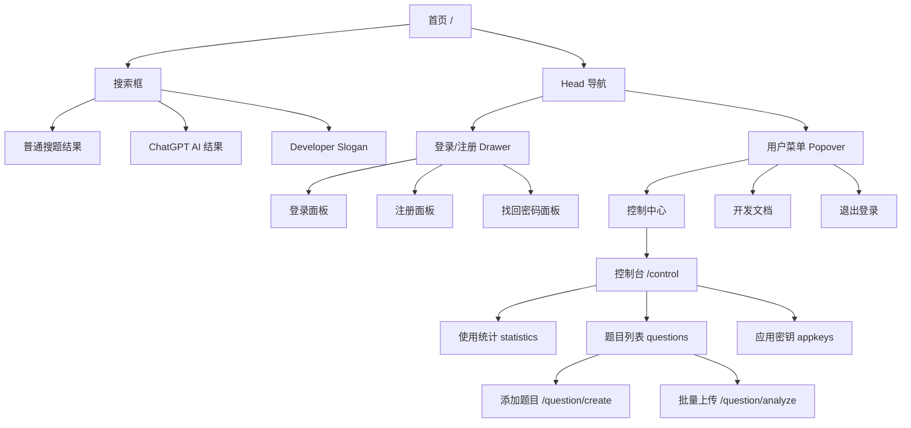
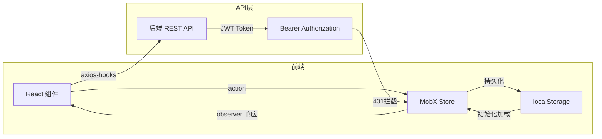

# 全能搜题网页端 PRD

> 本 PRD 由 project-analyzer skill 基于源码逆向分析自动生成
> 生成时间: 2026-05-31T16:00:00+08:00
> 源码路径: `Github baseline与逆向PRD分析/全能搜题网页端/`
> 关联报告: [AI\_MODEL\_USAGE\_ANALYSIS.md](../AI_MODEL_USAGE_ANALYSIS.md)

***

## 1. 文档信息

| 字段   | 内容                                                         |
| ---- | ---------------------------------------------------------- |
| 文档名称 | 全能搜题网页端 - 产品需求文档                                           |
| 产品名称 | 全能搜题（study.zmide.com）                                      |
| 产品类型 | Web 前端 SPA（前后端分离架构）                                        |
| 技术栈  | React 17 + TypeScript + MobX + React Router v6 + rsuite UI |
| 开源协议 | MIT License                                                |
| 分析版本 | 基于 GitHub 仓库 master 分支源码                                   |

## 2. 项目概述与需求背景

### 2.1 产品简介

全能搜题是一个基于开源社区公开贡献的永久免费搜题系统。项目采用前后端分离架构，本 PRD 聚焦于其 **Web 前端**。产品核心价值是让用户通过关键词搜索题目并获得答案，同时支持社区贡献题库。

### 2.2 业务背景

- 题库资源依赖社区公开贡献，用户可自行提交题目扩充题库
- 除关键词匹配搜题外，实验性集成了 ChatGPT AI 搜题能力（需登录+VIP内测权限）
- 提供公开 API（应用密钥机制），允许第三方开发者对接搜题能力
- 前端开源，后端 API 公开，降低接入门槛

### 2.3 核心问题

- 普通题库搜题覆盖不足（依赖社区贡献量）
- AI 搜题为实验性功能，仅对 VIP 内测用户开放
- 需要完善的题目贡献流程来扩充题库

## 3. 产品定位与目标

### 3.1 产品定位

面向学生群体的**免费、开源、社区驱动**的在线搜题工具，支持关键词搜题与 AI 智能搜题双模式。

### 3.2 核心目标

| 目标    | 描述                   | 衡量指标           |
| ----- | -------------------- | -------------- |
| 搜题响应  | 用户输入关键词后快速返回匹配结果     | 响应时间 < 2s      |
| 题库扩充  | 支持用户通过手动添加和批量上传贡献题目  | 题目提交成功率 ≥ 95%  |
| AI 辅助 | 为内测用户提供 ChatGPT 智能解题 | AI 响应成功率 ≥ 90% |
| 开放生态  | 允许第三方通过 API 密钥接入搜题服务 | 密钥创建成功率 100%   |

## 4. 目标用户与场景

### 4.1 用户角色

| 角色       | 描述                | 核心需求                  |
| -------- | ----------------- | --------------------- |
| 游客用户     | 未登录的访客            | 快速搜题、浏览               |
| 注册用户     | 已注册登录的学生          | 搜题、使用 AI 搜题（如开通）、贡献题目 |
| VIP 内测用户 | 具有 `is_vip` 标识的用户 | 使用 ChatGPT AI 搜题      |
| 第三方开发者   | 通过 API 密钥接入的开发者   | 在自己的应用中调用搜题 API       |

### 4.2 核心用户场景

| 场景编号 | 场景名称          | 用户角色     | 前置条件             | 核心流程                        |
| ---- | ------------- | -------- | ---------------- | --------------------------- |
| S1   | 关键词搜题         | 游客/注册用户  | 无                | 输入关键词 → 搜索 → 查看匹配题目与答案      |
| S2   | ChatGPT AI 搜题 | VIP 内测用户 | 已登录 + 启用 ChatGPT | 输入关键词 → 搜索 → 同时查看 AI 答案     |
| S3   | 手动添加题目        | 注册用户     | 已登录              | 选择题型 → 输入题目/选项 → 标记答案 → 提交  |
| S4   | 批量上传题目        | 注册用户     | 已登录              | 选择 XLSX → 预览校对 → 映射列 → 批量提交 |
| S5   | 管理题目列表        | 注册用户     | 已登录              | 查看列表 → 翻页浏览                 |
| S6   | 创建 API 密钥     | 注册用户     | 已登录              | 填写应用信息 → 生成密钥 → 查看/管理密钥     |
| S7   | 注册/登录         | 游客       | 无                | 填写信息 → 邮箱验证 → 登录            |

## 5. 功能清单

### 5.1 核心功能模块

| 模块   | 功能点           | 优先级 | 功能描述                                         |
| ---- | ------------- | --- | -------------------------------------------- |
| 搜题   | 关键词搜题         | P0  | 输入题目关键词，通过后端题库全文检索返回匹配题目和答案                  |
| 搜题   | ChatGPT AI 搜题 | P1  | 针对 VIP 内测用户，在关键词搜索基础上并行调用 AI 生成解题内容          |
| 用户   | 邮箱注册          | P0  | 填写昵称/邮箱/验证码/密码完成注册，支持 60s 验证码重发倒计时           |
| 用户   | 邮箱登录          | P0  | 使用邮箱+密码登录，登录后刷新用户信息和 API 授权 Token            |
| 用户   | 密码找回          | P1  | 通过邮箱验证码重置密码                                  |
| 题目管理 | 手动添加          | P0  | 支持判断题/单选题/多选题三种题型，动态增删选项，实时校验                |
| 题目管理 | XLSX 批量上传     | P1  | 四步向导：选择格式→上传文件→校对映射→确认提交；自动解析表格              |
| 题目管理 | 题目列表          | P1  | 分页展示最近上传的 100 道题目，支持翻页浏览                     |
| 控制台  | 使用统计          | P1  | 展示用户的上传题目数、应用密钥数、ChatGPT 权限状态                |
| 控制台  | 应用密钥管理        | P1  | 创建/查看 API 密钥（API Token + APP Secret），用于第三方对接 |
| 控制台  | 设置中心          | P1  | 控制 ChatGPT 开关、开发者 slogan 显示开关                |
| 通用   | 404 页面        | P2  | 路由不匹配时显示友好提示页，提供返回按钮                         |

### 5.2 AI/大模型功能点

| 功能点           | Agent             | 大模型任务         | 输入约束                             | 输出约束                            | 技术要点                                           |
| ------------- | ----------------- | ------------- | -------------------------------- | ------------------------------- | ---------------------------------------------- |
| ChatGPT AI 搜题 | 后端 ChatGPT 服务     | 根据搜索关键词生成解题内容 | 关键词 (string, 通过 GET query param) | Markdown 文本 (data.data.content) | 需登录+VIP 内测权限；前端使用 Skeleton 骨架屏展示加载状态；异常降级为错误文本 |
| AI 功能开关       | 前端 SettingStorage | 无             | 用户手动切换 Toggle                    | boolean (localStorage)          | VIP 用户默认开启；开关状态持久化到 localStorage               |

### 5.3 功能详细说明

#### 5.3.1 首页 — 搜题主界面

**页面概述**: 产品核心入口，提供搜索框、搜题结果展示、ChatGPT AI 答案展示。无需登录即可使用普通搜题。

**页面布局（ASCII 线框图）**:

```Markdown
+------------------------------------------------------------+
|  [AppHead]  Logo              Login/Register | User Menu   |
+------------------------------------------------------------+
|                                                            |
|  +------------------------------------------------------+  |
|  |  [Search input: "What problem are you facing?"] [Btn] |  |
|  +------------------------------------------------------+  |
|                                                            |
|  +-- ChatGPT Beta Notice (if not enabled) ----------------+  |
|  |  [Experimental] ChatGPT AI search is available...      |  |
|  +------------------------------------------------------+  |
|                                                            |
|  +-- Normal Search Result -------------------------------+  |
|  |  Question: xxxx                                       |  |
|  |  Answer:   xxxx                                       |  |
|  +------------------------------------------------------+  |
|                                                            |
|  +-- ChatGPT AI Result (VIP beta users only) ------------+  |
|  |  Keywords: xxxx                         [ChatGPT] Tag |  |
|  |  [Skeleton Loading State]                             |  |
|  |  AI generated answer (Markdown)                       |  |
|  +------------------------------------------------------+  |
|                                                            |
|  +-- Developer Slogan (optional) ------------------------+  |
|  |  Night's Watch oath ...                   [Collapse]  |  |
|  +------------------------------------------------------+  |
|                                                            |
+------------------------------------------------------------+
|  [AppFooter] ICP | GitHub | API Docs | Links               |
+------------------------------------------------------------+
```

> 注：中文界面实际渲染为：「让我看看你遇到什么样的难题了」、题目/答案、ChatGPT 标签、守夜人誓词、"收起"按钮。

**功能点**:

| 功能点              | 描述                          | 操作方式                   | 来源                         |
| ---------------- | --------------------------- | ---------------------- | -------------------------- |
| 关键词输入            | 输入搜索关键词                     | Input 组件，支持回车触发搜索      | `views/home/index.tsx:48`  |
| 普通搜题             | 调用 `/api/open/seek?q=` 搜索题目 | 点击搜索按钮/回车              | `views/home/index.tsx:65`  |
| AI 搜题            | 并行调用 `/api/gpt?q=` 获取 AI 答案 | 与普通搜题同步触发              | `views/home/index.tsx:142` |
| 结果展示             | 显示题目内容和答案                   | 条件渲染 result 对象         | `views/home/index.tsx:132` |
| ChatGPT 提示       | 未启用时显示内测推广提示                | Message 组件 + 可关闭       | `views/home/index.tsx:138` |
| Developer Slogan | 开发者守夜人誓词展示                  | 可收起，登录后可设置重新开启         | `views/home/index.tsx:145` |
| Ackee 统计         | 页面访问统计                      | 自动上报至 tongji.zmide.com | `views/home/index.tsx:30`  |

**数据字段**:

| 字段                      | 类型      | 说明            |
| ----------------------- | ------- | ------------- |
| keyword                 | string  | 用户输入的搜索关键词    |
| result.question         | string  | 搜索匹配到的题目内容    |
| result.answer           | string  | 搜索匹配到的答案      |
| queryChatGPT            | string  | 传递给 AI 接口的查询词 |
| searchConfig.netLoading | boolean | 搜题按钮加载状态      |

**交互流程**:

1. 用户输入关键词 → 点击搜索或回车
2. 若关键词为空 → 弹出警告提示"你还没说要查啥题目呢！"
3. 若关键词不为空 → 设置 `netLoading=true`，发起普通搜题请求
4. 同时设置 `queryChatGPT=keyword`，触发 ChatGPT 结果组件
5. 普通搜题返回 → 渲染结果面板；若 code≠200 → 弹出错误提示
6. ChatGPT 组件独立加载 → 渲染 AI 答案或错误信息

**异常处理**:

- 关键词为空：toaster 警告提示
- 网络请求失败：toaster 错误提示（显示错误消息）
- API 返回非 200：toaster 错误提示（显示 msg）
- ChatGPT API 失败：显示 `error.message` 或 "ChatGPT 服务异常"

#### 5.3.2 用户系统 — 登录/注册/找回密码（Drawer 侧边面板）

**页面概述**: 以 Drawer（侧边滑出面板）形式呈现，包含登录、注册、找回密码三个 Tab 面板，支持面板间切换。

**页面布局（ASCII 线框图）**:

```
+-- Drawer Side Panel ---------------------------------------+
|  [Tab Switch] Login | Register | Forgot Password           |
+------------------------------------------------------------+
|                                                            |
|  << Login Tab >>                                           |
|  Account/Email:  [___________________]                     |
|  Password:       [___________________]                     |
|  [Login]  [Forgot Password]     [Register]                 |
|                                                            |
+------------------------------------------------------------+
|  << Register Tab >>                                        |
|  Nickname:       [___________________]                     |
|  Email:          [___________________]                     |
|  Verify Code:    [_____] [Get Code (60s countdown)]        |
|  Password:       [___________________]                     |
|  Confirm:        [___________________]                     |
|  [Register]                       [Have account? Login]    |
|                                                            |
+------------------------------------------------------------+
|  << Forgot Password Tab >>                                 |
|  Email:          [___________________]                     |
|  Verify Code:    [_____] [Get Code (60s countdown)]        |
|  New Password:   [___________________]                     |
|  Confirm:        [___________________]                     |
|  [Reset Password]                  [Back to Login]         |
+------------------------------------------------------------+
```

> 注：中文界面实际渲染为：「登录」「注册」「找回密码」「账号/邮箱」「密码」「立即登录」「昵称」「邮箱地址」「验证码」「获取验证码」「确认密码」「重置密码」等。

**功能点**:

| 功能点    | API                     | 描述                                |
| ------ | ----------------------- | --------------------------------- |
| 登录     | POST `/api/auth/login`  | email + password → JWT Token      |
| 注册     | POST `/api/auth/reg`    | name + email + code + password    |
| 获取验证码  | POST `/api/auth/send`   | email + type → 发送邮箱验证码            |
| 找回密码   | POST `/api/auth/forgot` | email + code + password + confirm |
| 验证码倒计时 | 前端实现                    | 60s 倒计时，期间按钮 disabled             |
| 登录成功   | `UserStore.login(data)` | 存储用户信息 + 初始化 Axios 请求头            |

**数据字段**:

| 字段                   | 类型      | 说明                        |
| -------------------- | ------- | ------------------------- |
| UserStore.me         | object  | 当前登录用户信息（含 access\_token） |
| UserStore.me.is\_vip | boolean | 是否为内测用户                   |
| UserStore.me.name    | string  | 用户昵称                      |
| UserStore.me.email   | string  | 用户邮箱                      |

**交互流程**:

1. 点击 Head 区域"登录/注册"按钮 → 打开 Drawer → 默认显示登录面板
2. 登录面板 → 填写邮箱+密码 → 点击登录 → API 调用 → 成功写入 UserStore → 关闭 Drawer → 刷新用户信息
3. 注册面板 → 填写信息 → 获取邮箱验证码（60s 倒计时）→ 提交注册
4. 找回密码面板 → 邮箱验证 → 设置新密码
5. 登录失败 → toaster 显示错误消息

**权限规则**:

- `login: true` 的路由需要用户已登录，否则不渲染路由组件
- Axios 拦截器检测 `code === 401` → 自动调用 `UserStore.loginOut()` 登出
- 未登录用户无法访问 `/control/`、`/question/create`、`/question/analyze`

#### 5.3.3 控制台 — 使用统计 / 题目列表 / 应用密钥 / 设置

**页面概述**: 登录后的控制台页面，左侧垂直导航栏 + 右侧内容区域，包含四个子页面。

**页面布局（ASCII 线框图）**:

```
+------------------------------------------------------------+
|  [AppHead]                                                 |
+------------------+-----------------------------------------+
|  Sidebar Nav     |  Content Area                           |
|                  |                                         |
|  Statistics      |  +--------+ +--------+ +-------------+  |
|  Question List   |  | Upload | |  Keys  | | ChatGPT     |  |
|  App Keys        |  | Count  | | Count  | | : Beta User |  |
|                  |  +--------+ +--------+ +-------------+  |
|                  |                                         |
|                  |  Settings:                               |
|                  |  Enable ChatGPT:     [Toggle]            |
|                  |  Show Dev Slogan:    [Toggle]            |
|                  |                                         |
+------------------+-----------------------------------------+
|  [AppFooter]                                               |
+------------------------------------------------------------+
```

> 注：中文界面实际渲染为：「控制台导航」「使用统计」「题目列表」「应用密钥」「上传题目数」「密钥数」「ChatGPT 权限」「内测用户」「启用 ChatGPT 搜索」「显示开发者 slogan」。

**功能点**:

| 子页面  | API                            | 核心功能                                               |
| ---- | ------------------------------ | -------------------------------------------------- |
| 使用统计 | GET `/api/panel/stats`         | 展示 count\_questions, count\_appsecrets, is\_vip 状态 |
| 题目列表 | GET `/api/question/list`       | 分页列表（最近 100 道），支持翻页                                |
| 应用密钥 | GET `/api/appsecret/list`      | 查看已创建的密钥列表                                         |
| 应用密钥 | POST `/api/appsecret/generate` | 创建新密钥（name + website → api\_token + app\_secret）   |
| 设置   | localStorage                   | ChatGPT 开关 + Developer Slogan 开关                   |

**交互流程**:

- 进入控制台 → 默认跳转 `statistics` 子路由
- 启用 ChatGPT 开关 → `SettingStorage.setEnableChatGPT(true)` → 持久化到 localStorage
- 关闭时自动隐藏 ChatGPT 提示条

#### 5.3.4 添加题目 — 手动添加页面

**页面概述**: 提供表单式题目添加界面，支持判断题/单选题/多选题，动态管理选项。

**页面布局（ASCII 线框图）**:

```
+------------------------------------------------------------+
|  [AppHead]                                                 |
+------------------------------------------------------------+
|  Add Question                     [Clear Data] [Submit]     |
|  --------------------------------------------------------  |
|  Control Center > Add Question                             |
|                                                            |
|  Question Type:  ( ) True/False (*) Single ( ) Multiple    |
|                                                            |
|  Content:       [________________________________________] |
|                                                            |
|  Options:                                                  |
|  +-- Option A -------------------------------------------+ |
|  | [X] A. [______________] [Correct / Wrong]              | |
|  +-- Option B -------------------------------------------+ |
|  | [X] B. [______________] [Correct / Wrong]              | |
|  +-- Option C -------------------------------------------+ |
|  | [X] C. [______________] [Correct / Wrong]              | |
|  +-- Option D -------------------------------------------+ |
|  | [X] D. [______________] [Correct / Wrong]              | |
|  +-------------------------------------------------------+ |
|  [+ Add Option]                                             |
|                                                            |
+------------------------------------------------------------+
|  [AppFooter]                                               |
+------------------------------------------------------------+
```

> 注：中文界面实际渲染为：「添加题目」「清空数据」「确认提交」「控制中心 > 添加题目」「题目类型」「判断题」「选择题」「多选题」「题目内容」「题目选项」「正确答案」「错误答案」「增加选项」。

**题目类型差异**:

| 题型  | type 值 | 选项区域        | 数据格式                          |
| --- | ------ | ----------- | ----------------------------- |
| 判断题 | 3      | 正确/错误 Radio | `{answer: true/false}`        |
| 单选题 | 0      | 动态选项列表      | `[{name, content, isanswer}]` |
| 多选题 | 1      | 动态选项列表      | `[{name, content, isanswer}]` |

**校验规则**:

| 校验项     | 规则             | 触发时机 |
| ------- | -------------- | ---- |
| 内容为空    | 题目内容和选项数据不能为空  | 提交前  |
| 选项不足    | 选择题至少 2 个选项    | 提交前  |
| 无正确答案   | 至少一个选项标记为正确答案  | 提交前  |
| JSON 格式 | 选项数据必须是合法 JSON | 提交前  |

**交互流程**:

1. 选择题目类型 → 动态渲染对应选项区域
2. 填写题目内容与选项 → Toggle 标记正确/错误答案
3. 可增删选项（删除时自动重新编号 A/B/C/D...）
4. 点击确认提交 → 前端校验 → API 提交 → 成功清空表单
5. 点击清空数据 → 弹出二次确认 → 清空所有输入

**异常处理**:

- 提交时 `netLoading=true`，按钮禁用防重复提交
- API 失败 → toaster 显示错误消息
- 题型切换时清空之前选项数据

#### 5.3.5 批量上传 — XLSX 文件解析向导

**页面概述**: 四步向导流程，支持上传 Excel 文件批量导入题目。包含选择格式→上传文件→数据校对（列映射）→确认提交四个步骤。

**页面布局（ASCII 线框图）**:

```
+------------------------------------------------------------+
|  [AppHead]                                                 |
+------------------------------------------------------------+
|  Batch Upload                                    [Clear]    |
|  --------------------------------------------------------  |
|  Control Center > Batch Upload                             |
|                                                            |
|  (*) Format -> ( ) Upload -> ( ) Verify -> ( ) Confirm     |
|                                                            |
|  +-- Step 0: Select Format ------------------------------+ |
|  |  +------------------+                                  | |
|  |  | XLSX File Upload |                                  | |
|  |  | Import questions |                                  | |
|  |  | via spreadsheet  |                                  | |
|  |  +------------------+                                  | |
|  +-------------------------------------------------------+ |
|                                                            |
|  +-- Step 1: Upload File --------------------------------+ |
|  |  +--------------------------------------------------+ | |
|  |  |     Click or drag file here to upload            | | |
|  |  +--------------------------------------------------+ | |
|  |  Download template file first for best results.       | |
|  +-------------------------------------------------------+ |
|                                                            |
|  +-- Step 2: Verify Data (Preview + Column Mapping) -----+ |
|  |  +--------------------------------------------------+ | |
|  |  | ID | ColA | ColB | ColC | ColD | ColE | Action  | | |
|  |  | 1  | xxx  | xxx  | xxx  | xxx  | xxx  | Delete  | | |
|  |  +--------------------------------------------------+ | |
|  |  Content Col: [Picker v]  Answer Col: [Picker v]      | |
|  |  Option A: [Picker v]  Option B: [Picker v] ...       | |
|  |  [+ Add Option]                        [Submit]       | |
|  +-------------------------------------------------------+ |
|                                                            |
|  +-- Step 3: Confirm -----------------------------------+ |
|  |       Upload Success! N questions uploaded.           | |
|  |       [View Upload List]                              | |
|  +-------------------------------------------------------+ |
|                                                            |
+------------------------------------------------------------+
|  [AppFooter]                                               |
+------------------------------------------------------------+
```

> 注：中文界面实际渲染为：「批量上传」「清空数据」「控制中心 > 批量上传」「选择数据格式」「上传数据」「校对数据」「确认上传数据」「点击或拖拽文件到该区域即可上传」「建议通过下载模版文件填充题目后批量上传和解析题目」「题目内容」「正确答案」「增加选项」「确定提交」「上传成功，本次上传 N 道题目」「查看题目上传列表」。

**数据解析逻辑 (Steps02.tsx)**:

| 解析场景  | 判断条件                              | 处理方式                                        |
| ----- | --------------------------------- | ------------------------------------------- |
| 选项模式  | 用户选择了列映射（options map 非空）且有效选项 ≥ 2 | 解析为选择题/多选题，生成 `[{name, content, isanswer}]` |
| 非选项模式 | 未选择列映射 或 有效选项 ≤ 1                 | 解析为未知题型，答案取自答案列或第一个非空选项列                    |

**答案解析策略**:

- `#` 分隔 → 多选题答案数组：`"A#B#C"` → `["A","B","C"]`
- 纯字母匹配 → 字母数组：`"ABC"` → `["A","B","C"]`
- 中文分隔符 `,` `.` `#` → 中文答案数组
- 其他 → 原样返回

**交互流程**:

1. Step 0 → 选择 XLSX 格式 → 进入 Step 1
2. Step 1 → 上传文件 → XLSX.js 解析 → 数据清洗（去除空行/null）→ 传递到父组件 → 进入 Step 2
3. Step 2 → 展示表格预览 → 用户通过 SelectPicker 映射列（题目内容/正确答案/选项）→ 前端校验 → 提交
4. Step 3 → 显示上传成功数量 → 提供跳转链接

**异常处理**:

- 文件加载失败 → 提示"上传失败，请重新上传"
- API 提交失败 → Modal 弹窗显示错误消息
- 清空数据 → Modal 二次确认

## 6. 页面路由与信息架构

### 6.1 路由表

| 路径                    | 页面      | 组件             | 需要登录 | 说明              |
| --------------------- | ------- | -------------- | ---- | --------------- |
| `/`                   | 首页      | HomeView       | 否    | 搜题主界面           |
| `/control`            | 控制台（容器） | ControlView    | 是    | 默认跳转 statistics |
| `/control/statistics` | 使用统计    | UseStatistics  | 是    | 数据面板+设置         |
| `/control/questions`  | 题目列表    | QuestionList   | 是    | 分页列表            |
| `/control/appkeys`    | 应用密钥    | ApplicationKey | 是    | 密钥管理            |
| `/question/create`    | 添加题目    | QuestionCreate | 是    | 手动添加            |
| `/question/analyze`   | 批量上传    | XlsxAnalyze    | 是    | XLSX 向导         |
| `*`                   | 404     | NotFoundView   | 否    | 兜底页面            |

### 6.2 信息架构



### 6.3 组件树

```
App
├── HashRouter
│   └── Routes
│       ├── HomeView (首页)
│       │   ├── AppHead (导航栏 + 登录Drawer)
│       │   ├── SearchBox (搜索框)
│       │   ├── SearchResult (普通结果)
│       │   ├── ResultChatGPTItem (AI结果)
│       │   │   └── Skeleton (加载骨架屏)
│       │   ├── DeveloperSlogan
│       │   └── AppFooter (页脚)
│       ├── ControlView (控制台)
│       │   ├── Nav (垂直导航)
│       │   ├── UseStatistics (统计面板)
│       │   ├── QuestionList (题目列表)
│       │   └── ApplicationKey (密钥管理)
│       ├── QuestionCreate (添加题目)
│       │   └── OptionView (选项组件)
│       │       └── OptionsItem (单个选项)
│       ├── XlsxAnalyze (批量上传)
│       │   ├── Steps00 (选择格式)
│       │   ├── Steps01 (上传文件)
│       │   ├── Steps02 (校对映射)
│       │   └── Steps03 (确认完成)
│       └── NotFound (404)
```

## 7. 状态管理与数据流

### 7.1 状态管理架构

| Store          | 类型              | 持久化                       | 职责                             |
| -------------- | --------------- | ------------------------- | ------------------------------ |
| UserStore      | MobX Observable | localStorage (`me`)       | 用户登录状态、access\_token、用户信息      |
| SettingStorage | MobX Observable | localStorage (`settings`) | ChatGPT 开关、开发者 slogan 显示、提示条状态 |

### 7.2 数据流



### 7.3 API 端点汇总

| 方法   | 路径                        | 认证 | 功能            |
| ---- | ------------------------- | -- | ------------- |
| GET  | `/api/open/seek?q=`       | 否  | 公开搜题          |
| GET  | `/api/gpt?q=`             | 是  | ChatGPT AI 搜题 |
| POST | `/api/auth/login`         | 否  | 邮箱登录          |
| POST | `/api/auth/reg`           | 否  | 邮箱注册          |
| POST | `/api/auth/send`          | 否  | 发送验证码         |
| POST | `/api/auth/forgot`        | 否  | 找回密码          |
| POST | `/api/auth/me`            | 是  | 获取当前用户信息      |
| POST | `/api/question/add`       | 是  | 添加题目          |
| POST | `/api/question/submit`    | 是  | 批量提交题目        |
| GET  | `/api/question/list`      | 是  | 题目列表          |
| GET  | `/api/panel/stats`        | 是  | 使用统计          |
| GET  | `/api/appsecret/list`     | 是  | 密钥列表          |
| POST | `/api/appsecret/generate` | 是  | 创建密钥          |

## 8. 非功能性需求

### 8.1 性能要求

| 指标        | 目标值     | 说明                                |
| --------- | ------- | --------------------------------- |
| 首页首屏加载    | < 3s    | React SPA + rsuite UI 打包体积优化      |
| 搜题 API 响应 | < 2s    | 关键词全文检索                           |
| AI 搜题响应   | < 15s   | ChatGPT API 调用耗时较长，Skeleton 骨架屏过渡 |
| 路由跳转      | < 500ms | 代码分割 + React.lazy 懒加载             |
| XLSX 解析   | < 5s    | 前端 XLSX.js 解析，数据量适中               |

### 8.2 安全需求

| 需求       | 实现方式                                                                  |
| -------- | --------------------------------------------------------------------- |
| API 鉴权   | Bearer JWT Token，存储在 `axios.defaults.headers.common['Authorization']` |
| 401 自动登出 | Axios 拦截器检测 `data.code === 401` 触发 `UserStore.loginOut()`             |
| 路由守卫     | `login: true` 路由在未登录时不渲染                                              |
| XSS 防护   | 使用 `sanitize-html` 库过滤用户输入内容                                          |
| 敏感数据     | 密码通过 HTTPS POST 传输，不存储在 localStorage                                  |

### 8.3 可用性需求

| 需求    | 实现方式                                   |
| ----- | -------------------------------------- |
| 加载状态  | Skeleton 骨架屏 (AI搜题) + Loader 组件 (列表加载) |
| 错误提示  | toaster 全局消息通知                         |
| 防重复提交 | `netLoading` 状态锁 + 按钮 `loading` 属性     |
| 表单校验  | 提交前前端校验 + 后端兜底校验                       |
| 空状态   | 搜题结果为空时不显示结果面板                         |

### 8.4 兼容性需求

- 浏览器: 支持 Chrome/Firefox/Safari/Edge 最新两个大版本
- 响应式: 使用 rsuite FlexboxGrid 进行基础适配
- 桌面优先: 主要面向桌面浏览器使用场景

## 9. 迭代规划与风险

### 9.1 当前版本功能（基于源码分析）

**已完成**:

- [x] 关键词搜题（公开 API）
- [x] ChatGPT AI 搜题（实验性，VIP 内测）
- [x] 邮箱注册/登录/找回密码
- [x] 手动添加题目（判断/单选/多选）
- [x] XLSX 批量上传题目
- [x] 题目列表（分页浏览）
- [x] 应用密钥管理
- [x] 使用统计面板
- [x] 用户设置（ChatGPT/开发者标语开关）
- [x] 第三方开发者 API 对接

### 9.2 建议迭代方向

| 迭代   | 功能                 | 优先级 | 依赖             |
| ---- | ------------------ | --- | -------------- |
| V1.1 | AI 搜题全量开放（取消VIP限制） | P1  | 后端 AI API 成本可控 |
| V1.1 | 搜题历史记录             | P2  | 用户登录           |
| V1.1 | 题目收藏/错题本           | P2  | 后端接口           |
| V1.2 | 移动端响应式适配           | P1  | UI 重构          |
| V1.2 | 题目分类/标签筛选          | P2  | 后端接口           |
| V1.3 | 多轮 AI 对话式解题        | P1  | 后端 Agent 架构    |

### 9.3 技术风险

| 风险                | 严重程度 | 应对措施                                |
| ----------------- | ---- | ----------------------------------- |
| AI 回答准确性问题        | 高    | 前端展示 "AI 生成内容仅供参考" 免责声明；建议后端添加置信度评分 |
| 题库数据合规性           | 高    | README 已包含免责声明；建议后端添加内容审核机制         |
| XLSX 解析兼容性        | 中    | 当前仅支持第一种 sheet 和标准格式；建议增加更多容错处理     |
| ChatGPT API 稳定性   | 中    | 前端已有错误降级（显示错误文本而非崩溃）                |
| 前端无 AI Prompt 控制  | 中    | AI 质量完全依赖后端，前端无法干预；建议前后端协同优化        |
| localStorage 数据丢失 | 低    | 仅存储非敏感设置；登录态通过 JWT Token 保持         |

## 10. 附录

### 10.1 关键术语表

| 术语            | 说明                                           |
| ------------- | -------------------------------------------- |
| SPA           | Single Page Application，单页应用                 |
| MobX          | JavaScript 状态管理库，使用 Observable + Observer 模式 |
| rsuite        | React Suite，一套 React UI 组件库                  |
| axios-hooks   | 基于 axios 的 React Hooks 封装，简化 API 请求状态管理      |
| JWT           | JSON Web Token，用于 API 鉴权                     |
| XLSX          | Excel 文件格式，通过 `xlsx` 库在前端解析                  |
| sanitize-html | HTML 内容清洗库，防止 XSS 攻击                         |
| Ackee         | 自托管网站分析工具（tongji.zmide.com）                  |
| ChatGPT       | 后端对接的大模型服务，用于 AI 搜题                          |

### 10.2 源码文件清单

| 文件路径                                               | 功能                       | 行数   |
| -------------------------------------------------- | ------------------------ | ---- |
| `src/App.tsx`                                      | 应用根组件，HashRouter 入口      | 37   |
| `src/index.tsx`                                    | ReactDOM 挂载入口            | 18   |
| `src/config.ts`                                    | 全局配置（serverURL, docsURL） | 11   |
| `src/api/axios.ts`                                 | Axios 实例配置、拦截器、JWT 注入    | 30   |
| `src/api/index.ts`                                 | API 模块导出                 | 12   |
| `src/routers/routes.ts`                            | 路由配置表                    | 49   |
| `src/routers/index.tsx`                            | 路由渲染组件（login 守卫）         | 43   |
| `src/stores/UserStore.ts`                          | 用户状态管理                   | 58   |
| `src/stores/SettingStorage.ts`                     | 设置状态管理                   | 58   |
| `src/stores/localStorage.ts`                       | localStorage 封装          | 41   |
| `src/stores/index.ts`                              | Store Context 导出         | 17   |
| `src/views/home/index.tsx`                         | 首页搜题主界面                  | 237  |
| `src/views/control/index.tsx`                      | 控制台容器                    | 58   |
| `src/views/control/UseStatistics.tsx`              | 使用统计                     | 75   |
| `src/views/control/QuestionList.tsx`               | 题目列表                     | 110  |
| `src/views/control/ApplicationKey.tsx`             | 应用密钥管理                   | 190  |
| `src/views/question/QuestionCreate.tsx`            | 手动添加题目                   | 500+ |
| `src/views/question/XlsxAnalyze.tsx`               | 批量上传容器                   | 182  |
| `src/views/question/analyzes/Steps00.tsx`          | 选择格式                     | 36   |
| `src/views/question/analyzes/Steps01.tsx`          | 上传文件                     | 89   |
| `src/views/question/analyzes/Steps02.tsx`          | 数据校对映射                   | 399+ |
| `src/views/question/analyzes/Steps03.tsx`          | 确认完成                     | 40   |
| `src/views/question/analyzes/ParseFileDataUtil.ts` | XLSX 数据清洗                | 27   |
| `src/views/NotFound.tsx`                           | 404 页面                   | 30   |
| `src/components/AppHead.tsx`                       | 导航栏 + 登录/注册/找回面板         | 399+ |
| `src/components/AppFooter.tsx`                     | 页脚                       | 49   |
| `src/components/ResultChatGPTItem.tsx`             | ChatGPT AI 结果组件          | 55   |
| `src/components/skeleton/Skeleton.tsx`             | 骨架屏组件                    | 100  |

***

> **文档状态**: ✅ PRD 生成完成
> **待确认**: 后端服务（parsing-topic）的 AI Prompt 设计和 Model 配置需要单独分析
> **建议**: 对后端仓库 `github.com/zmide/parsing-topic` 进行 project-analyzer 分析以获取完整 AI 架构视图

