# AI 智能搜题 - 产品需求文档(PRD)

## 文档信息

| 字段 | 内容 |
|---|---|
| 文档名称 | AI 智能搜题产品需求文档 |
| 版本号 | V1.0 |
| 作者 | AI 产品经理智能体 |
| 创建时间 | 2026-06-01 |
| 更新时间 | 2026-06-01 |
| 相关人员 | 产品负责人、AI 算法工程师、前端工程师、后端工程师、测试工程师 |

### 更新记录

| 版本 | 更新日期 | 更新人 | 更新内容 |
|---|---|---|---|
| V1.0 | 2026-06-01 | AI 产品经理智能体 | 初始版本,基于产品原型生成 |

---

## 1. 需求背景

### 1.1 业务背景

当前学生在做作业或复习时,遇到不会的题目,传统"拍照搜题"类产品直接给出答案,导致学生产生依赖心理,缺乏真正理解知识点的过程。长期来看,这种"抄答案"模式不利于学生学习能力的培养。

市场需要一款既能帮助学生解决题目,又能引导学生独立思考、理解知识点的 AI 陪练工具。

### 1.2 用户背景

**目标用户**: 中小学生(以小学阶段为主)、家长

**用户特征**:
- 学生在做作业时遇到不会的题目,需要帮助但不想直接抄答案
- 家长希望孩子能真正理解知识点,而非依赖搜题软件
- 学生需要个性化的学习路径,针对薄弱点进行练习

### 1.3 问题定义

| 问题 | 描述 |
|---|---|
| 学生依赖答案 | 传统搜题工具直接给答案,学生缺乏思考过程 |
| 知识点理解不深 | 学生只看答案,不理解背后的知识点和应用方法 |
| 错题管理混乱 | 学生没有系统化的错题管理工具,难以复盘 |
| 缺乏个性化练习 | 无法根据学生的薄弱点生成针对性练习 |

### 1.4 产品目标

| 目标 | 衡量指标 |
|---|---|
| 引导学生独立思考 | 思考模式使用率 > 60% |
| 提升知识点理解度 | 举一反三练习正确率提升 > 30% |
| 错题管理效率 | 错题本活跃用户周留存 > 40% |
| 个性化学习 | 学习分析页面周访问次数 > 2 次/用户 |

---

## 2. 产品定位

### 2.1 产品定位

**AI 智能搜题**是一款面向中小学生的 AI 题目解析与启发式学习工具。不同于传统"拍照搜答案"产品,本产品核心理念是:

> **不直接给答案,而是引导学生思考;不只看结果,而是理解过程。**

### 2.2 产品核心价值

| 价值维度 | 描述 |
|---|---|
| 对学生 | 通过 AI 引导式对话,真正理解知识点,而非死记答案 |
| 对家长 | 提供学习分析报告,了解孩子的薄弱点和进步情况 |
| 对学习效果 | 通过错题本和举一反三练习,形成"学习-练习-复盘"闭环 |

### 2.3 AI 相比传统方案的优势

| 对比维度 | 传统搜题工具 | AI 智能搜题 |
|---|---|---|
| 答案呈现方式 | 直接展示完整答案 | 分步解析,引导选择学习方式 |
| 学习模式 | 被动接收答案 | 主动思考,AI 针对性讲解卡点 |
| 错题管理 | 手动收藏或截图 | AI 自动沉淀对话摘要和薄弱点分析 |
| 练习生成 | 固定题库 | AI 根据薄弱点动态生成针对性练习 |
| 可视化讲解 | 静态图文 | AI 动态生成数量关系图、数轴图等 |

---

## 3. 用户故事

### 3.1 用户故事清单

| ID | 用户故事 | 优先级 | 版本 |
|---|---|---|---|
| US01 | 作为学生,我希望通过输入文字或上传照片快速搜索题目,以便获得题目解析 | P0 | V1.0 |
| US02 | 作为学生,我希望 AI 分步展示解题过程,以便理解每一步的逻辑 | P0 | V1.0 |
| US03 | 作为学生,我希望进入思考模式让 AI 引导我思考,而非直接看答案 | P0 | V1.0 |
| US04 | 作为学生,我希望在思考模式中向 AI 提问哪里不会,以便针对性解决卡点 | P0 | V1.0 |
| US05 | 作为学生,我希望 AI 能生成可视化图表帮助我理解数量关系 | P1 | V1.0 |
| US06 | 作为学生,我希望将错题保存到错题本,以便后续复习 | P0 | V1.0 |
| US07 | 作为学生,我希望查看自己的知识薄弱点分析,以便知道该重点复习什么 | P0 | V1.0 |
| US08 | 作为学生,我希望 AI 根据我的薄弱点生成针对性练习题,以便巩固知识点 | P0 | V1.0 |
| US09 | 作为学生,我希望在练习时答案默认隐藏,由我主动查看,以便先独立思考 | P1 | V1.0 |
| US10 | 作为学生,我希望按科目分类查看错题,以便快速找到特定科目的错题 | P1 | V1.0 |

### 3.2 用户故事详细说明

#### US01: 题目搜索

**用户角色**: 学生

**使用场景**: 做作业时遇到不会的题目

**用户目标**: 快速获得题目解析

**用户痛点**: 手动输入题目文字麻烦,拍照后希望 AI 自动识别

**产品能力**:
- 支持文本输入搜题
- 支持图片上传搜题(OCR 识别)
- 支持语音输入(预留)

**验收标准**:

**正向行为(When satisfied)**:
- 当用户输入题目文字并点击搜索时,系统应跳转到搜题结果页并展示 AI 解析
- 当用户上传题目图片时,系统应 OCR 识别题目文字并跳转到结果页

**负向行为(When not satisfied)**:
- 当图片模糊无法识别时,系统应提示"图片识别失败,请重新上传或手动输入题目"
- 当输入内容为空时,系统应提示"请输入题目内容"

---

#### US03: 思考模式引导

**用户角色**: 学生

**使用场景**: 希望真正理解题目,而非直接看答案

**用户目标**: 通过 AI 引导式对话,逐步理解知识点

**用户痛点**: 直接看答案容易遗忘,需要有人引导思考

**产品能力**:
- AI 询问学生哪里不会
- 针对性讲解知识点
- 判断是否需要可视化讲解
- 确认学生是否理解
- 引导学生尝试作答

**验收标准**:

**正向行为**:
- 当用户进入思考模式时,AI 应主动询问"你哪里不明白?"
- 当用户回答卡点时,AI 应先讲解知识点,再说明如何应用到题目中
- 当用户表示理解后,AI 应让学生尝试作答

**负向行为**:
- 当用户回答"没懂"时,AI 应继续询问是下一个知识点不会还是不会应用,进入循环讲解
- 当 AI 响应超时(>30秒)时,系统应提示"AI 正在思考,请稍候"并重试

---

## 4. Agent 故事

### 4.1 搜题解析 Agent

:::info 场景描述
学生上传题目图片或输入题目文字后,搜题解析 Agent 负责识别题目、解析题意、生成标准解法,并推荐思考模式。
:::

**模型故事**:
- **上下文信息**: 学生上传的题目图片或题目文本,用户 ID,历史搜题记录
- **能力支持**: 多模态 OCR 识别、题目解析、分步解题生成、思考模式推荐
- **工具清单**: 
  - `ocr_tool`: 多模态 LLM 图片识别
  - `problem_parser`: 题目解析与知识点提取
  - `solution_generator`: 分步解题步骤生成
  - `thinking_recommender`: 思考模式推荐话术生成
- **约束条件**: 
  - MVP 阶段仅支持小学数学题目
  - 非数学题目返回降级提示
  - 禁止输出完整思考链,只输出解题步骤

---

### 4.2 思考引导 Agent

:::info 场景描述
学生进入思考模式后,思考引导 Agent 负责诊断学生卡点,针对性讲解知识点,并通过循环确认确保学生真正理解。
:::

**模型故事**:
- **上下文信息**: 题目内容、标准解法、分步解题步骤、学生对话历史
- **能力支持**: 卡点诊断、知识点讲解、可视化讲解生成、理解确认、作答校验
- **工具清单**:
  - `knowledge_point_explainer`: 知识点讲解生成
  - `visual_generator`: 可视化讲解 JSON 生成(数量关系图、数轴图)
  - `understanding_checker`: 理解确认话术生成
  - `answer_validator`: 学生作答校验
- **约束条件**:
  - 不得直接给出答案,必须引导学生思考
  - 讲解必须包含知识点和在题目中的应用方法
  - 必须循环确认直到学生表示完全理解

---

### 4.3 学习分析 Agent

:::info 场景描述
学生加入错题本后,学习分析 Agent 负责对本次对话进行摘要,生成知识薄弱点分析,并生成举一反三练习题。
:::

**模型故事**:
- **上下文信息**: 错题本记录、历史对话摘要、薄弱点分析文档
- **能力支持**: 对话摘要、薄弱点提取、举一反三题目生成
- **工具清单**:
  - `conversation_summarizer`: 对话摘要生成
  - `weak_point_extractor`: 薄弱知识点提取
  - `practice_question_generator`: 举一反三题目生成
- **约束条件**:
  - 每次生成 3 道练习题(MVP 固定)
  - 每道题必须标注考察知识点
  - 题目难度应与原题相当或略低

---

## 5. 用户旅程

### 5.1 端到端主流程

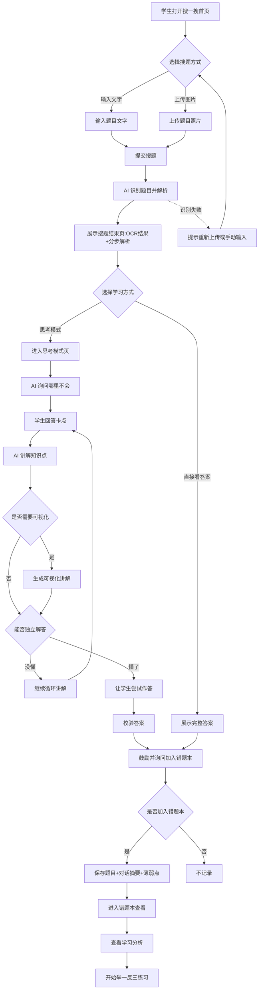

### 5.2 主流程覆盖模块对齐表

| Coverage Index ID | 页面/模块 | PRD 章节定位 | 流程图节点名 | 是否覆盖 |
|---|---|---|---|---|
| [P01] | 搜一搜首页 | 7.1.1 | A、B、C、D | ✅ |
| [P02] | 搜题结果页 | 7.1.2 | F、G、H、J | ✅ |
| [P03] | 思考模式页 | 7.1.3 | I、K、L、M、N、O、P、Q、R、S、T | ✅ |
| [P05] | 错题本列表页 | 7.2.1 | X | ✅ |
| [P06] | 学习分析页 | 7.3.1 | Y | ✅ |
| [P07] | 举一反三页 | 7.3.2 | Z | ✅ |

---

## 6. Agent 旅程与协作流

### 6.1 搜题到思考模式的 Agent 协作

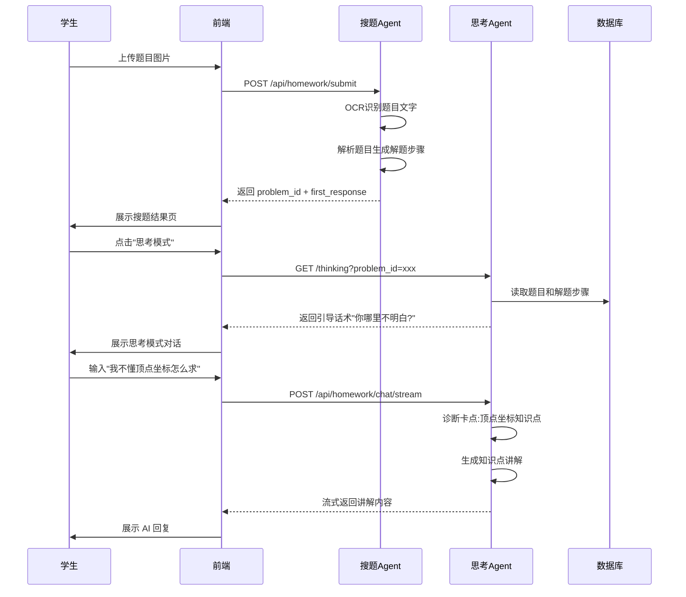

### 6.2 错题本与学习分析的 Agent 协作

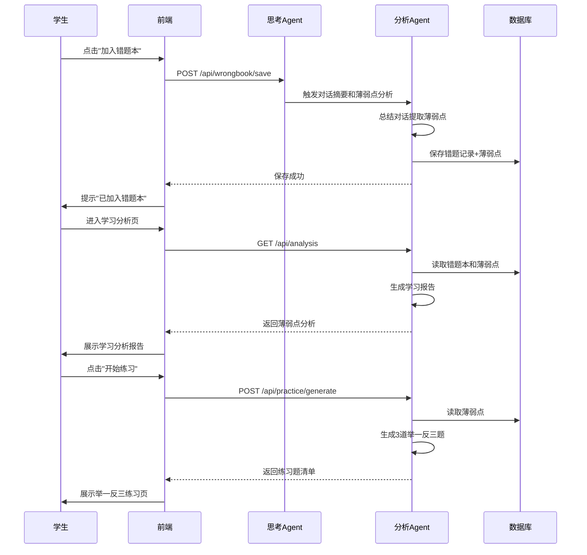

---

## 7. 功能清单与详细说明

### 7.0 功能覆盖索引(Coverage Index)

| ID | 页面/组件名称 | PRD 章节定位 | 覆盖状态 |
|---|---|---|---|
| [P01] | 搜一搜首页 | 7.1.1 | ✅已覆盖 |
| [P02] | 搜题结果页 | 7.1.2 | ✅已覆盖 |
| [P03] | 思考模式页 | 7.1.3 | ✅已覆盖 |
| [P04] | 对话记录页 | 7.1.4 | ✅已覆盖 |
| [P05] | 错题本列表页 | 7.2.1 | ✅已覆盖 |
| [P06] | 学习分析页 | 7.3.1 | ✅已覆盖 |
| [P07] | 举一反三页 | 7.3.2 | ✅已覆盖 |
| [D01] | 删除确认弹窗 | 7.2.2 | ✅已覆盖 |
| [D02] | 上传题目弹窗 | 7.1.5 | ✅已覆盖 |
| [D03] | 图示讲解弹窗 | 7.1.6 | ✅已覆盖 |
| [D04] | 加入错题本弹窗 | 7.1.7 | ✅已覆盖 |

---

### 7.1 搜题模块

#### 7.1.1 [P01] 搜一搜首页

**页面布局(实际截图)**

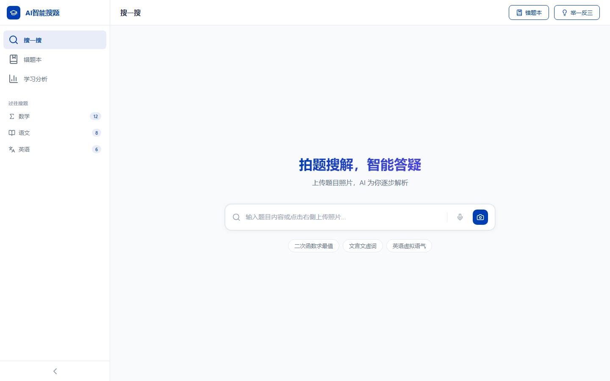

**页面目标**: 提供题目搜索入口,支持文本输入、图片上传和自由对话三种模式

**入口位置**: 侧边栏导航"搜一搜"、应用默认首页

**使用角色**: 学生

**前置条件**: 无

##### 搜索筛选区

| 字段 | 类型 | 必填 | 默认值 | 说明 |
|---|---|---|---|---|
| 搜索框 | 文本输入 | 否 | 空 | 输入题目文字,支持回车提交 |
| 搜索模式 | 切换开关 | 否 | 搜题模式 | 搜题/对话两种模式切换 |

##### 全局操作按钮

| 按钮名称 | 位置 | 点击行为 | 前置条件 |
|---|---|---|---|
| 搜索 | 搜索框右侧/回车 | 提交搜题,跳转到结果页 | 搜索框有内容 |
| 上传照片 | 搜索框内相机图标 | 打开上传弹窗 | 无 |
| 语音输入 | 搜索框内麦克风图标 | 开启语音输入(预留) | 无 |
| 错题本 | 顶部导航栏 | 跳转到错题本列表页 | 无 |
| 举一反三 | 顶部导航栏 | 跳转到举一反三页 | 无 |

##### 页面交互逻辑

**主流程**:
1. 用户打开页面,看到搜索中心和热门搜题提示
2. 用户选择搜题方式:
   - **文本搜题**: 在搜索框输入题目文字,按回车或点击搜索按钮
   - **图片搜题**: 点击相机图标,打开上传弹窗
   - **对话模式**: 点击顶部"对话"切换,进入自由对话
3. 提交搜题后,页面跳转到搜题结果页

**对话模式交互**:
1. 切换到对话模式后,搜索中心隐藏,展示对话区域
2. 用户输入问题,AI 流式回复
3. 对话不关联具体题目,用于自由提问

##### 业务规则

- MVP 阶段仅支持小学数学题目
- 非数学题目在结果页返回降级提示
- 搜索历史记录按科目分类收纳在侧边栏
- 侧边栏默认折叠,展开后显示过往搜题

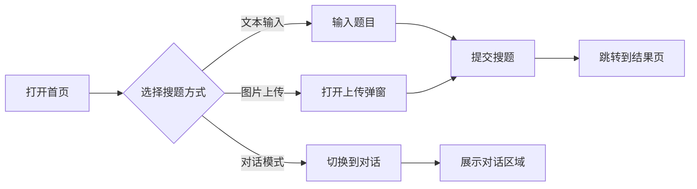

**逐段解释**:
- 节点 A: 用户打开搜一搜首页,看到搜索中心
- 节点 B: 用户选择三种搜题方式之一
- 节点 C/D: 文本输入或图片上传
- 节点 F: 提交搜题请求到后端
- 节点 G: 跳转到搜题结果页展示 AI 解析
- 节点 E/H: 对话模式不跳转,直接在当前页对话

##### 数据来源说明

- 热门搜索提示:前端硬编码,后续可从后端获取
- 过往搜题记录:从数据库读取该用户的搜题历史,按科目分类
- 对话模式:调用 `/api/chat/general/stream` 接口

**来源依据**: 基于原型截图 P01 和代码 `frontend/js/index.js` 识别

---

#### 7.1.2 [P02] 搜题结果页

**页面布局(实际截图)**

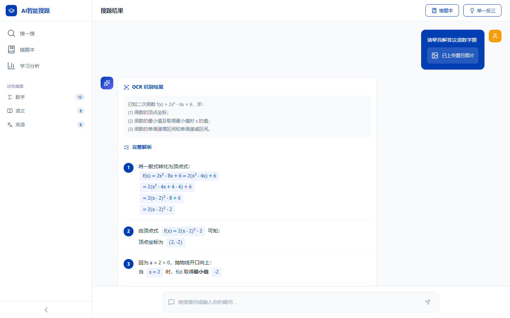

**页面目标**: 展示 AI 对题目的完整解析,引导用户选择学习方式(思考模式或直接看答案)

**入口位置**: 从搜一搜首页提交搜题后跳转

**使用角色**: 学生

**前置条件**: 用户已提交题目(文本或图片)

##### 页面元素说明

| 区域 | 内容 | 说明 |
|---|---|---|
| 用户消息区 | 题目文字/图片 | 展示用户提交的题目内容 |
| OCR 识别结果区 | AI 识别的题目文字 | 图片搜题时展示 OCR 结果 |
| 分步解析区 | 解题步骤卡片(Step 1-N) | 每步一个卡片,逐步展示 |
| 学习模式选择区 | 思考模式/直接看答案 | 推荐思考模式,也支持直接看答案 |
| 直接答案区 | 最终答案+完整步骤 | 用户选择后展示(默认隐藏) |
| 错题本引导区 | 是否加入错题本 | 解析完成后询问(默认隐藏) |

##### 全局操作按钮

| 按钮名称 | 位置 | 点击行为 | 前置条件 |
|---|---|---|---|
| 错题本 | 顶部导航栏 | 跳转到错题本列表页 | 无 |
| 举一反三 | 顶部导航栏 | 跳转到举一反三页 | 无 |
| 思考模式 | 学习模式选择区 | 跳转到思考模式页 | 无 |
| 直接看答案 | 学习模式选择区 | 展开直接答案区 | 无 |
| 加入错题本 | 错题本引导区 | 调用保存接口 | 有 problem_id |
| 不需要 | 错题本引导区 | 隐藏引导区 | 无 |

##### 页面交互逻辑

**主流程**:
1. 用户从首页提交搜题后跳转到此页
2. 页面展示用户提交的题目和 AI 的分步解析
3. 用户选择学习方式:
   - **思考模式**: 点击跳转到思考模式页
   - **直接看答案**: 点击后展开答案区,展示最终答案
4. 答案展示后,页面询问是否加入错题本
5. 用户选择加入则调用保存接口,否则隐藏引导

**异常流程**:
- 若 AI 解析超时,展示"AI 正在分析题目,请稍候"
- 若题目无法识别,提示"题目识别失败,请重新上传"

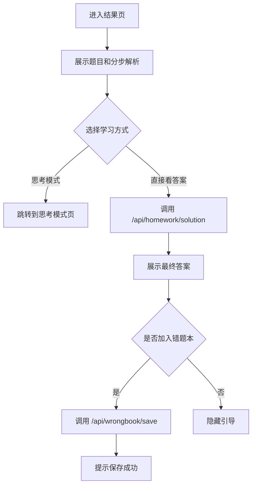

**逐段解释**:
- 节点 A: 从首页跳转进入,携带 problem_id
- 节点 B: 展示 OCR 结果和分步解析
- 节点 C: 用户二选一
- 节点 D: 进入思考模式,开始引导式对话
- 节点 E/F: 调用接口生成完整答案
- 节点 G-J: 错题本保存流程

##### 数据规则

- `problem_id`: 搜题成功后后端生成,存储在 sessionStorage
- `first_response`: AI 首次回复内容,用于分步解析展示
- `solution_steps`: 调用 `/api/homework/solution` 获取完整解题步骤
- `final_answer`: 最终答案文本

**来源依据**: 基于原型截图 P02 和代码 `frontend/js/result.js` 识别

---

#### 7.1.3 [P03] 思考模式页

**页面布局(实际截图)**

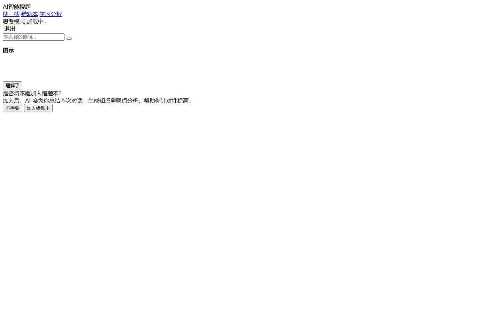

**页面目标**: 通过 AI 引导式对话,帮助学生真正理解题目中的知识点,而非直接看答案

**入口位置**: 从搜题结果页点击"思考模式"进入

**使用角色**: 学生

**前置条件**: 已有 problem_id(从结果页跳转时传入)

##### 页面元素说明

| 区域 | 内容 | 说明 |
|---|---|---|
| 顶部导航栏 | 返回按钮+标题+Token 计数+退出按钮 | 返回结果页,显示 AI 用量,退出思考模式 |
| 对话区域 | AI 和学生的对话消息流 | 展示引导式对话历史 |
| 输入区域 | 文本输入框+发送按钮 | 学生输入问题或回答 |

##### 页面交互逻辑

**主流程**:
1. 用户进入思考模式页,AI 主动询问"你哪里不明白?"
2. 学生输入卡点(如"我不懂顶点坐标怎么求")
3. AI 讲解对应知识点,并说明如何应用到题目中
4. AI 判断是否需要生成可视化讲解(数量关系图/数轴图)
5. AI 询问学生"现在你能自己试着解答了吗?"
6. 学生回答:
   - **没懂**: AI 继续询问是下一个知识点不会还是不会应用,进入循环
   - **懂了**: AI 让学生尝试作答,校验答案
7. 作答完成后,AI 展示标准答案并鼓励学生
8. AI 询问是否将本题加入错题本

**可视化讲解交互**:
- AI 在回复中嵌入 `[可视化讲解JSON]` 标记
- 前端解析 JSON,渲染数量关系图或数轴图
- 用户点击图示可弹窗放大查看

**理解确认循环**:
```
AI: 你哪里不明白?
学生: 不懂顶点坐标
AI: [讲解顶点坐标知识点] + [说明如何应用到题目]
AI: 现在你能自己试着解答了吗?
学生: 还不能
AI: 是下一个知识点没懂,还是不会应用?
学生: 不会应用
AI: [针对性讲解应用方法]
...循环直到学生表示懂了...
```

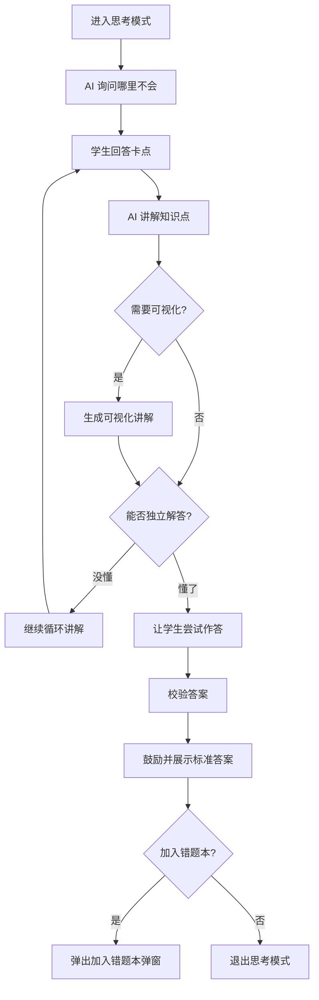

**逐段解释**:
- 节点 A: 从结果页跳转,携带 problem_id
- 节点 B: AI 主动发起引导
- 节点 C: 学生表达卡点
- 节点 D: AI 针对性讲解
- 节点 E/F: 判断并生成可视化讲解
- 节点 G: 理解确认关键点
- 节点 H: 循环讲解直到理解
- 节点 I/J: 作答和校验
- 节点 K-N: 结束流程,询问是否保存错题

##### 业务规则

- 思考模式必须引导式对话,不得直接给出完整答案
- 讲解必须包含知识点概念和在题目中的应用方法
- 可视化讲解仅支持数量关系图和数轴图(MVP)
- 学生作答校验由 AI 判断,不强制要求完全一致
- 退出思考模式后,可选择是否加入错题本

##### 异常处理

| 异常场景 | 处理方式 |
|---|---|
| AI 响应超时(>30秒) | 展示"AI 正在思考,请稍候",自动重试 |
| AI 回复格式错误 | 展示"回复解析失败,请重试",允许重新提问 |
| 网络断开 | 展示"网络连接失败,请检查网络",保留对话历史 |
| 可视化 JSON 解析失败 | 忽略可视化部分,仅展示文字回复 |

**来源依据**: 基于原型截图 P03 和代码 `frontend/js/thinking.js` 识别

---

#### 7.1.4 [P04] 对话记录页

**页面布局(实际截图)**

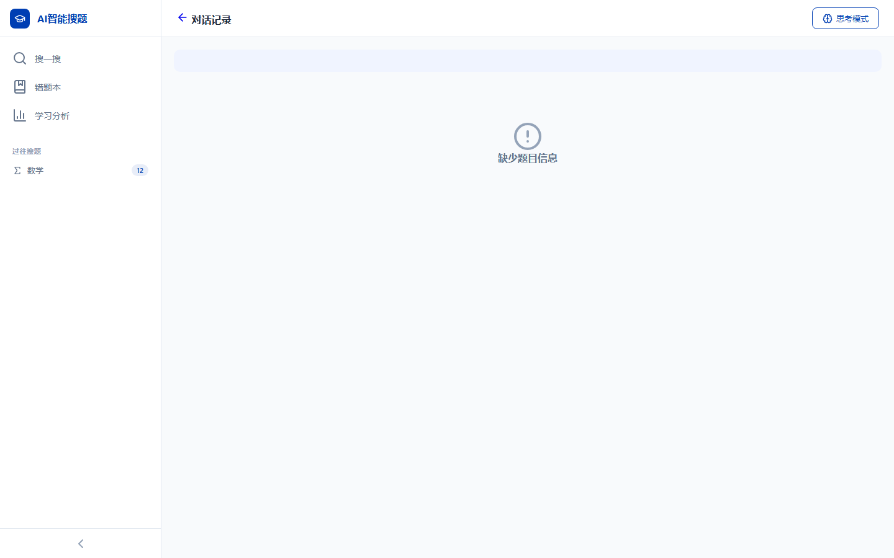

**页面目标**: 展示与 AI 的完整对话历史,方便学生回顾讲解过程

**入口位置**: 从错题本列表页点击对话记录进入(待确认:是否从其他页面也可进入)

**使用角色**: 学生

**前置条件**: 已有 problem_id

##### 页面元素说明

| 区域 | 内容 | 说明 |
|---|---|---|
| 顶部导航栏 | 返回按钮+标题+思考模式入口 | 返回错题本,可进入思考模式 |
| 题目信息区 | 科目+题目文字 | 展示对话关联的题目 |
| 对话区域 | AI 和学生的对话消息流 | 展示完整对话历史 |

##### 页面交互逻辑

1. 用户从错题本进入,查看某道题的对话记录
2. 页面展示题目信息和完整对话历史
3. 用户可点击"思考模式"按钮重新进入思考模式继续对话

##### 业务规则

- 对话记录与 problem_id 关联
- 支持流式消息的完整展示
- 返回按钮跳转错题本列表页

**来源依据**: 基于原型截图 P07 和代码 `frontend/js/conversation.js` 识别

---

#### 7.1.5 [D02] 上传题目弹窗

**页面布局(实际截图)**


*(注:上传弹窗在首页截图中未展开,以下为功能说明)*

**页面目标**: 让用户上传题目照片,支持预览和提交

**触发方式**: 点击搜一搜首页的相机图标

**页面元素**:

| 元素 | 说明 |
|---|---|
| 拖拽上传区 | 点击或拖拽照片上传,支持 JPG/PNG/WEBP |
| 图片预览区 | 上传后展示预览,支持删除重选 |
| 取消按钮 | 关闭弹窗,清空已选图片 |
| 开始搜题按钮 | 上传图片后显示,点击提交搜题 |

**交互逻辑**:
1. 点击相机图标,弹窗打开
2. 用户点击拖拽区或选择文件
3. 图片加载后展示预览,隐藏拖拽区,显示"开始搜题"按钮
4. 点击"开始搜题",关闭弹窗,调用搜题接口,跳转到结果页
5. 点击"取消"或遮罩层,关闭弹窗,清空预览

**业务规则**:
- 图片格式限制:JPG、PNG、WEBP
- 图片大小限制:待确认(MVP 建议 10MB)
- 图片转 base64 后提交给后端 OCR 识别

---

#### 7.1.6 [D03] 图示讲解弹窗

**页面目标**: 放大展示 AI 生成的可视化讲解图表

**触发方式**: 思考模式中点击可视化图表

**页面元素**:

| 元素 | 说明 |
|---|---|
| 图表标题 | 可视化图表的标题(如"数量关系图") |
| 图表内容 | 数量关系图、数轴图等 |
| 提示说明 | AI 生成的讲解提示 |
| 理解了按钮 | 关闭弹窗,继续对话 |

**交互逻辑**:
1. 点击图表,弹窗打开并放大展示
2. 点击"理解了"或遮罩层,关闭弹窗

---

#### 7.1.7 [D04] 加入错题本弹窗

**页面目标**: 确认是否将当前题目加入错题本

**触发方式**: 思考模式结束后,点击"加入错题本"

**页面元素**:

| 元素 | 说明 |
|---|---|
| 弹窗标题 | "是否将本题加入错题本?" |
| 说明文案 | "加入后,AI 会为你总结本次对话,生成知识薄弱点分析" |
| 不需要按钮 | 关闭弹窗,不保存 |
| 加入错题本按钮 | 调用保存接口,关闭弹窗,提示成功 |

**交互逻辑**:
1. 弹窗打开
2. 点击"加入错题本",调用 `/api/wrongbook/save`
3. 保存成功后关闭弹窗,展示成功提示
4. 点击"不需要",关闭弹窗

---

### 7.2 错题本模块

#### 7.2.1 [P05] 错题本列表页

**页面布局(实际截图)**


**页面目标**: 按科目分类展示错题,支持查看、删除和跳转到学习分析

**入口位置**: 侧边栏导航"错题本"、顶部导航栏"错题本"

**使用角色**: 学生

**前置条件**: 用户有错题记录

##### 页面状态

错题本列表页有两种视图状态:

**状态一:科目网格视图(默认)**
- 展示科目卡片网格(数学、语文、英语)
- 每个卡片显示科目名称和错题数量
- 点击科目卡片进入该科目的错题列表

**状态二:错题列表视图**
- 展示某一科目的错题列表
- 每条错题展示题目预览和操作按钮
- 点击错题可查看对话记录或删除

##### 全局操作按钮

| 按钮名称 | 位置 | 点击行为 | 前置条件 |
|---|---|---|---|
| 举一反三 | 顶部导航栏 | 跳转到举一反三页 | 无 |
| 查看分析 | 顶部导航栏 | 跳转到学习分析页 | 无 |
| 返回 | 错题列表视图左上角 | 返回科目网格视图 | 在错题列表视图 |
| 删除 | 每条错题行内 | 弹出删除确认弹窗 | 有错题记录 |

##### 页面交互逻辑

**科目网格视图流程**:
1. 进入错题本,展示科目网格
2. 每个科目卡片显示:科目图标、科目名称、错题数量
3. 点击科目卡片,进入该科目的错题列表视图

**错题列表视图流程**:
1. 展示返回按钮和科目名称
2. 展示错题列表,每条包含题目预览
3. 点击错题,跳转到对话记录页
4. 点击删除按钮,弹出删除确认弹窗

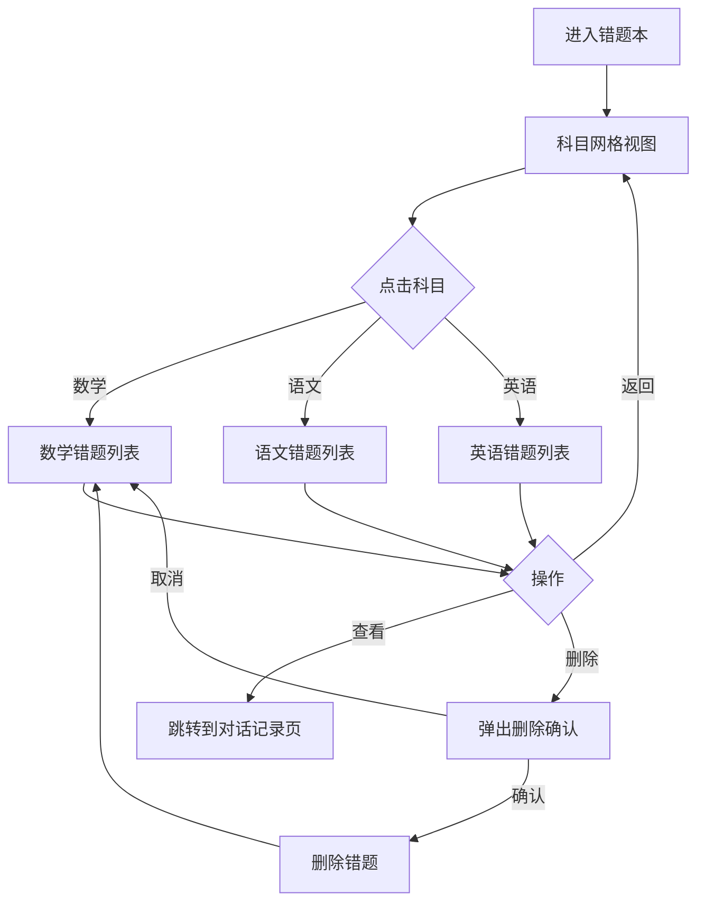

**逐段解释**:
- 节点 A: 用户从侧边栏或导航栏进入错题本
- 节点 B: 默认展示科目网格
- 节点 C: 用户选择科目
- 节点 D/E/F: 进入对应科目的错题列表
- 节点 G: 用户对错题进行操作
- 节点 H: 查看对话记录
- 节点 I/J: 删除流程

##### 数据规则

- 科目分类固定:数学、语文、英语(不允许模型自创科目)
- MVP 阶段仅数学有完整数据,语文/英语仅占位
- 错题数量实时从数据库统计
- 错题列表按加入时间倒序排列

##### 空状态处理

- 若无错题记录,科目网格展示空状态:
  - 图标:📚
  - 文案:"还没有错题记录,去搜题吧!"
  - 按钮:跳转到搜一搜首页

**来源依据**: 基于原型截图 P04 和代码 `frontend/js/errorbook.js` 识别

---

#### 7.2.2 [D01] 删除确认弹窗

**页面目标**: 二次确认用户是否删除错题

**触发方式**: 点击错题列表中的删除按钮

**页面元素**:

| 元素 | 说明 |
|---|---|
| 警告图标 | 红色三角警告图标 |
| 弹窗标题 | "确认删除" |
| 说明文案 | "确定要删除这道错题吗?删除后将无法恢复。" |
| 取消按钮 | 关闭弹窗,不删除 |
| 确认删除按钮 | 调用删除接口,关闭弹窗,刷新列表 |

**交互逻辑**:
1. 点击删除按钮,弹窗打开
2. 点击"确认删除",调用删除接口
3. 删除成功后关闭弹窗,刷新错题列表
4. 点击"取消"或遮罩层,关闭弹窗

**业务规则**:
- MVP 阶段删除后不可恢复(无回收站)
- 删除操作需二次确认,防止误操作

---

### 7.3 学习分析模块

#### 7.3.1 [P06] 学习分析页

**页面布局(实际截图)**

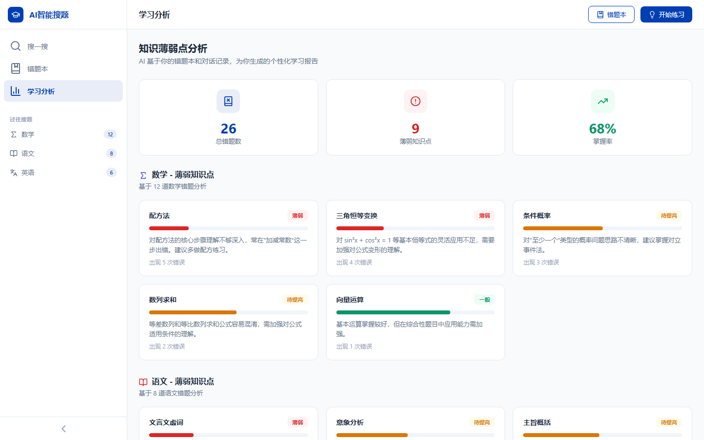

**页面目标**: 展示 AI 基于错题本和对话记录生成的个性化学习报告,帮助学生了解薄弱点

**入口位置**: 侧边栏导航"学习分析"、错题本顶部导航"查看分析"

**使用角色**: 学生

**前置条件**: 用户有错题记录(否则展示空状态)

##### 页面元素说明

| 区域 | 内容 | 说明 |
|---|---|---|
| 页面标题区 | "知识薄弱点分析" + 副标题 | 说明这是 AI 生成的学习报告 |
| 指标卡区域 | 统计指标(如错题总数、薄弱知识点数等) | [待确认:具体指标项] |
| 薄弱点清单 | 知识点列表+掌握程度 | AI 从对话和错题提取 |
| 进步趋势区域 | 学习进步可视化展示 | [待确认:具体图表类型] |
| 操作按钮区 | "开始练习"等 | 跳转到举一反三页 |

##### 全局操作按钮

| 按钮名称 | 位置 | 点击行为 | 前置条件 |
|---|---|---|---|
| 错题本 | 顶部导航栏 | 跳转到错题本列表页 | 无 |
| 开始练习 | 顶部导航栏 | 跳转到举一反三页 | 有薄弱点数据 |

##### 页面交互逻辑

**主流程**:
1. 用户进入学习分析页
2. 页面加载,调用分析接口
3. 展示 AI 生成的学习报告(加载中状态)
4. 用户查看薄弱点清单和指标
5. 点击"开始练习",跳转到举一反三页

**空状态**:
- 若无错题记录,展示空状态:
  - 图标:📊
  - 文案:"还没有学习数据,先去错题本看看吧"
  - 按钮:跳转到错题本

##### 数据规则

- 学习报告由 AI 基于错题本和对话记录生成
- 薄弱知识点包含:知识点名称、掌握程度(薄弱/一般/掌握)、关联错题数
- 报告生成时机:每次加入错题本时触发更新

##### [待确认] 具体展示内容

学习分析页的具体展示内容在原型中仅有 loading 状态,以下内容基于业务逻辑推测,需产品负责人确认:

| 待确认项 | 建议方案 | 确认状态 |
|---|---|---|
| 指标卡内容 | 错题总数、薄弱知识点数、本周练习数、正确率 | 待确认 |
| 薄弱点展示形式 | 列表+掌握程度标签+关联错题链接 | 待确认 |
| 进步趋势图表 | 折线图展示近 7 天正确率变化 | 待确认 |
| 报告更新频率 | 每次加入错题本后实时更新 | 待确认 |

**来源依据**: 基于原型截图 P06 和代码 `frontend/js/analysis.js` 识别

---

#### 7.3.2 [P07] 举一反三页

**页面布局(实际截图)**

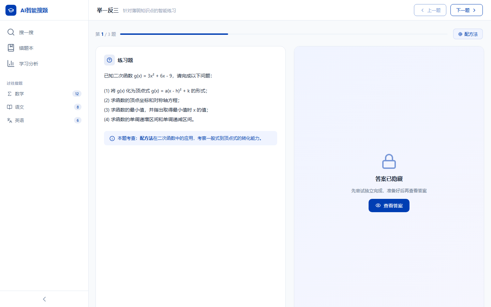

**页面目标**: 根据学生的薄弱知识点,AI 生成针对性练习题,帮助学生巩固知识点

**入口位置**: 顶部导航栏"举一反三"、学习分析页"开始练习"

**使用角色**: 学生

**前置条件**: 有薄弱点数据(否则展示空状态)

##### 页面元素说明

| 区域 | 内容 | 说明 |
|---|---|---|
| 顶部导航栏 | 标题+知识点说明+上一题/下一题按钮 | 展示当前进度 |
| 进度条区域 | 第 X/N 题+进度条+知识点标签 | 展示练习进度和考察知识点 |
| 题目区域 | 练习题内容 | AI 生成的练习题目 |
| 提示区域 | 知识点说明和提示 | 展示本题考察的知识点 |
| 答案区域 | 答案和解析(默认隐藏) | 用户主动查看后展示 |

##### 全局操作按钮

| 按钮名称 | 位置 | 点击行为 | 前置条件 |
|---|---|---|---|
| 上一题 | 顶部导航栏 | 切换到上一题 | 不是第 1 题 |
| 下一题 | 顶部导航栏 | 切换到下一题 | 不是最后 1 题 |
| 查看答案 | 答案区域 | 展开答案和解析 | 答案未展示 |

##### 页面交互逻辑

**主流程**:
1. 用户进入举一反三页,AI 生成 3 道练习题(MVP 固定)
2. 页面展示第 1 题,答案区域默认隐藏
3. 用户尝试作答(线下完成)
4. 用户点击"查看答案",展开答案和解析
5. 用户可查看上一题/下一题切换
6. 进度条实时更新

**答案展示逻辑**:
- 默认隐藏答案,展示"答案已隐藏"提示
- 鼓励文案:"先尝试独立完成,准备好后再查看答案"
- 点击"查看答案"后,展开答案内容
- 答案展示后,提示是否进入思考模式讲解(待确认)

```mermaid
flowchart TD
    A[进入举一反三] --> B[AI 生成 3 道练习题]
    B --> C[展示第 1 题,答案隐藏]
    C --> D{用户操作}
    D -->|查看答案| E[展开答案和解析]
    D -->|下一题| F[切换到第 2 题]
    D -->|上一题| G[切换到第 0 题(禁用)]
    E --> H{是否继续}
    F --> C
    H -->|是| F
    H -->|否| I[返回学习分析页]
```

**逐段解释**:
- 节点 A: 从学习分析页或导航栏进入
- 节点 B: AI 根据薄弱点生成 3 道题
- 节点 C: 默认展示第 1 题,答案隐藏
- 节点 D: 用户三种操作
- 节点 E: 查看答案
- 节点 F/G: 切换题目
- 节点 H: 完成练习后的选择

##### 数据规则

- 练习题数量:MVP 固定 3 道
- 每道题包含:题目内容、答案、解析、考察知识点、难度、来源错题 ID
- 题目由 AI 动态生成,非固定题库
- 知识点标签从薄弱点分析中提取

##### 异常处理

| 异常场景 | 处理方式 |
|---|---|
| AI 生成题目失败 | 展示"题目生成失败,请重试" |
| 无薄弱点数据 | 展示空状态,引导用户先去错题本 |
| 题目内容为空 | 展示"题目加载中",超时后提示重试 |

**来源依据**: 基于原型截图 P05 和代码 `frontend/js/practice.js` 识别

---

## 7.2 大模型/Agent 任务清单

### 7.2.1 搜题解析任务

| 任务名称 | 业务场景 | 触发条件 | 输入 | 输出 | 异常处理 |
|---|---|---|---|---|---|
| OCR 题目识别 | 从图片中识别题目文字 | 用户上传题目图片 | 图片 base64 | 题目文字 | 识别失败提示重新上传 |
| 题目解析 | 解析题目并生成解题步骤 | 搜题提交后 | 题目文字/OCR 结果 | 分步解题步骤 | 非数学题目返回降级提示 |
| 答案生成 | 生成完整答案 | 用户点击"直接看答案" | problem_id | 最终答案+步骤 | 超时提示重试 |

### 7.2.2 思考引导任务

| 任务名称 | 业务场景 | 触发条件 | 输入 | 输出 | 异常处理 |
|---|---|---|---|---|---|
| 卡点诊断 | 诊断学生卡点 | 学生回答哪里不会 | 学生问题+题目上下文 | 知识点诊断 | 无法诊断时引导重新提问 |
| 知识点讲解 | 讲解对应知识点 | 诊断出卡点后 | 知识点名称+题目 | 讲解内容 | 生成失败时重试 |
| 可视化讲解生成 | 生成可视化图表 JSON | 判断需要图示时 | 题目数据+知识点 | 可视化 JSON | JSON 解析失败忽略图示 |
| 作答校验 | 校验学生答案 | 学生尝试作答后 | 学生答案+标准答案 | 是否正确+反馈 | 校验失败时 AI 判断 |

### 7.2.3 学习分析任务

| 任务名称 | 业务场景 | 触发条件 | 输入 | 输出 | 异常处理 |
|---|---|---|---|---|---|
| 对话摘要生成 | 总结思考模式对话 | 思考模式结束后 | 对话历史 | 摘要文本 | 摘要失败保留原始对话 |
| 薄弱点提取 | 提取知识薄弱点 | 对话摘要后 | 摘要+题目知识点 | 薄弱点列表 | 无法提取时返回空列表 |
| 举一反三题目生成 | 生成针对性练习题 | 进入举一反三页 | 薄弱点+错题库 | 3 道练习题 | 生成失败提示重试 |

---

## 8. 提示词设计策略

### 8.1 搜题解析 Agent 提示词设计策略

#### 角色定义
- 角色名称: 小学数学题目解析专家
- 核心职责: 识别题目、解析题意、生成标准解法,并推荐思考模式

#### 任务目标
当收到题目图片或文字时,需要:
1. 如果是图片,先进行 OCR 识别提取题目文字
2. 解析题目,识别考察的知识点
3. 生成标准解法和分步解题步骤
4. 生成引导话术,推荐学生进入思考模式

#### 输出要求
- OCR 结果必须准确,识别失败返回明确错误
- 分步解题步骤必须逻辑清晰,每步一个知识点
- 引导话术必须推荐思考模式,而非直接给答案
- 非小学数学题目返回降级提示:"当前主要支持小学数学题目,这个题目我可以先帮你做基础识别,但深度讲解能力暂不完整。"

---

### 8.2 思考引导 Agent 提示词设计策略

#### 角色定义
- 角色名称: 启发式学习引导者
- 核心职责: 通过对话引导学生理解知识点,而非直接给答案

#### 任务目标
当学生进入思考模式后,需要:
1. 主动询问学生哪里不明白
2. 根据学生回答诊断卡点
3. 先讲解对应知识点概念
4. 说明知识点如何应用到当前题目
5. 判断是否需要生成可视化讲解
6. 询问学生是否能独立解答
7. 若没懂,继续循环讲解
8. 若懂了,让学生尝试作答并校验

#### 输出要求
- 不得直接给出完整答案
- 讲解必须包含知识点概念和应用方法
- 必须循环确认理解
- 使用适合小学生的语言风格
- 可视化讲解以 JSON 格式输出,标记为 `[可视化讲解JSON]`

---

### 8.3 学习分析 Agent 提示词设计策略

#### 角色定义
- 角色名称: 学习分析师
- 核心职责: 基于错题和对话生成学习报告,并生成针对性练习

#### 任务目标
当学生加入错题本后,需要:
1. 对本次思考模式对话进行摘要
2. 从对话和题目中提取知识薄弱点
3. 生成结构化学习报告
4. 根据薄弱点生成 3 道举一反三练习题

#### 输出要求
- 对话摘要必须简洁,突出关键卡点
- 薄弱点必须具体到知识点级别
- 练习题必须标注考察知识点
- 题目难度与原题相当或略低
- 每道题包含题目、答案、解析、知识点

---

## 9. 数据集需求

### 9.1 训练/优化数据需求

| 数据类型 | 用途 | 数据来源 | 数量要求 |
|---|---|---|---|
| 小学数学题目 | 优化题目识别和解析能力 | 公开题库/教材 | 待确认 |
| 解题步骤示例 | 优化分步解题生成质量 | 教师编写/教辅 | 待确认 |
| 学生提问对话 | 优化思考引导对话质量 | 产品上线后收集 | 持续积累 |
| 薄弱点标注 | 优化薄弱点提取准确性 | 教师标注 | 待确认 |

### 9.2 数据标注规范

- 题目数据必须包含:题目文字、标准答案、分步解题步骤、考察知识点
- 对话数据必须包含:学生提问、AI 回复、是否理解标签
- 薄弱点数据必须标注到知识点级别

---

## 10. 测试标准

### 10.1 功能测试

| 测试项 | 测试内容 | 验收标准 |
|---|---|---|
| 文本搜题 | 输入题目文字提交搜题 | 正确跳转到结果页并展示解析 |
| 图片搜题 | 上传题目图片提交搜题 | OCR 识别准确,展示识别结果和解析 |
| 思考模式 | 进入思考模式对话 | AI 引导式对话,不直接给答案 |
| 错题本保存 | 点击加入错题本 | 保存成功,可在错题本查看 |
| 学习分析 | 进入学习分析页 | 展示薄弱点分析报告 |
| 举一反三 | 进入举一反三页 | 展示 3 道练习题,答案默认隐藏 |

### 10.2 AI 效果测试

| 测试项 | 测试内容 | 验收标准 |
|---|---|---|
| OCR 识别准确率 | 测试 100 张小学数学题目图片 | 识别准确率 > 90% |
| 解题步骤质量 | 测试 50 道不同题型 | 步骤逻辑正确,无错误 |
| 思考引导质量 | 模拟 20 次对话 | AI 不直接给答案,引导式对话 |
| 薄弱点提取准确率 | 测试 30 次对话摘要 | 提取的薄弱点与题目知识点匹配 |
| 举一反三题目质量 | 生成 30 道练习题 | 题目与薄弱点相关,难度适当 |

### 10.3 性能测试

| 测试项 | 指标 | 验收标准 |
|---|---|---|
| 首字响应时间 | 搜题到首次展示 | < 3 秒 |
| 完整响应时间 | 图片上传到完整解析 | < 10 秒 |
| 思考模式对话响应 | AI 回复延迟 | < 5 秒 |
| 流式输出 | SSE 流式展示 | 流畅无明显卡顿 |
| 并发支持 | 同时在线用户 | MVP 支持 100 并发 |

---

## 11. 异常处理与 AI 降级方案

### 11.1 业务降级逻辑

| 场景 | 降级方案 | 触发条件 | 恢复策略 |
|---|---|---|---|
| 模型超时 | 展示"AI 正在思考,请稍候",30 秒后提示重试 | 请求超过 30 秒无响应 | 自动重试 1 次,仍失败提示稍后重试 |
| 模型不可用 | 展示"AI 服务维护中,请稍后再试" | 模型服务异常 | 服务恢复后自动切换 |
| OCR 识别失败 | 提示"图片识别失败,请重新上传或手动输入题目" | 返回空文字或识别置信度低 | 用户重新上传或手动输入 |
| 非支持学科 | 返回降级提示"当前主要支持小学数学" | 题目非小学数学 | 仍展示基础识别结果 |
| JSON 格式错误 | 忽略可视化部分,仅展示文字 | 可视化 JSON 解析失败 | 记录错误样本优化提示词 |
| 练习题生成失败 | 提示"题目生成失败,请重试" | AI 生成超时或错误 | 允许用户重新生成 |

### 11.2 模型超时处理

- 超时阈值:30 秒
- 降级方案:展示 loading 状态,超时后提示重试
- 重试策略:自动重试 1 次,仍失败提示稍后重试

### 11.3 内容安全过滤

**教育场景优先**:
- 过滤不适当内容(暴力、色情、政治敏感等)
- 学生提问若包含不当内容,返回引导提示
- AI 回复必须适合小学生阅读

### 11.4 幻觉控制

- AI 不得编造错误数学知识
- 解题步骤必须经过校验
- 学生答案校验由 AI 判断,但必须有标准答案对照

---

## 12. 技术可行性与风险预判

### 12.1 技术架构

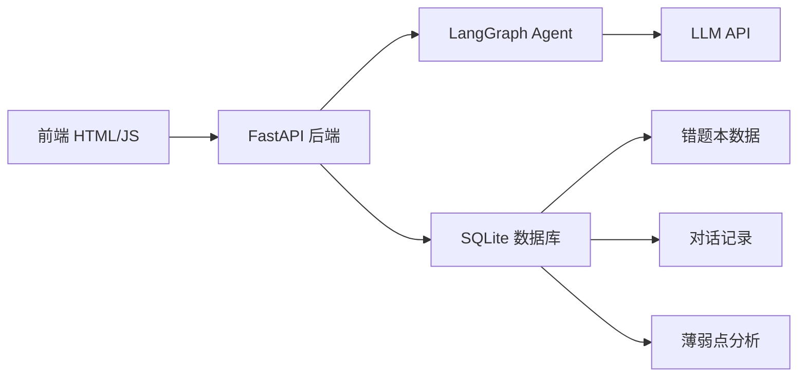

### 12.2 模型配置

| 配置项 | 说明 | 环境变量 |
|---|---|---|
| LLM Provider | 模型供应商 | `LLM_PROVIDER` |
| API Key | 模型 API Key | `LLM_API_KEY` 或 `DASHSCOPE_API_KEY` |
| Base URL | 模型 API 地址 | `LLM_BASE_URL` 或 `QWEN_BASE_URL` |
| Model Name | 模型名称 | `LLM_MODEL` 或 `QWEN_MODEL` |
| API Style | 接口风格 | OpenAI-compatible Chat Completions |

### 12.3 风险与应对

| 风险 | 影响 | 概率 | 应对措施 |
|---|---|---|---|
| OCR 识别率低 | 图片搜题体验差 | 中 | 使用多模态 LLM,支持手动输入备选 |
| AI 生成错误答案 | 误导学生学习 | 低 | 解题步骤需校验,关键知识点人工审核 |
| 模型成本高 | 运营压力大 | 中 | 缓存常见题目解法,优化 prompt 长度 |
| 学生过度依赖 AI | 学习效果打折扣 | 中 | 思考模式强制引导,不直接给答案 |
| 数据隐私 | 学生数据泄露 | 低 | 本地 SQLite 存储,不上传云端 |

### 12.4 Token 成本估算

| 场景 | 输入 Token | 输出 Token | 单次成本(预估) |
|---|---|---|---|
| 搜题解析 | 500-1000 | 1000-2000 | ¥0.02-0.05 |
| 思考模式对话 | 2000-5000 | 500-1000 | ¥0.03-0.08 |
| 学习分析 | 3000-8000 | 1000-2000 | ¥0.04-0.10 |
| 举一反三生成 | 1000-2000 | 2000-3000 | ¥0.03-0.06 |

---

## 13. 非功能性需求

### 13.1 性能需求

| 指标 | 要求 |
|---|---|
| 页面加载时间 | < 2 秒 |
| API 响应时间 | < 3 秒(首字) |
| 图片上传大小 | < 10MB |
| 并发支持 | 100 并发(MVP) |

### 13.2 安全需求

| 需求 | 说明 |
|---|---|
| API Key 安全 | 不得在前端代码中暴露 |
| 用户数据隔离 | 按 user_id 隔离数据 |
| 内容安全 | 过滤不当内容 |

### 13.3 可用性需求

| 需求 | 说明 |
|---|---|
| 服务可用性 | 99%(MVP) |
| 错误恢复 | 失败可重试 |
| 数据持久化 | SQLite 本地存储 |

### 13.4 兼容性需求

| 需求 | 说明 |
|---|---|
| 浏览器兼容 | Chrome、Edge、Safari 最新版本 |
| 设备兼容 | 桌面端优先,移动端适配 |
| 屏幕分辨率 | 1440x900 及以上 |

### 13.5 日志与监控

| 需求 | 说明 |
|---|---|
| 操作日志 | 记录用户搜题、保存错题等操作 |
| 错误日志 | 记录 API 调用失败、模型异常 |
| 性能监控 | 记录 API 响应时间、Token 使用量 |

---

## 14. 埋点与指标

### 14.1 核心指标

| 指标 | 定义 | 目标 |
|---|---|---|
| 日活跃用户(DAU) | 每日使用产品的用户数 | MVP 阶段 100+ |
| 搜题次数 | 每日搜题总次数 | 人均 3-5 次 |
| 思考模式使用率 | 使用思考模式的用户占比 | > 60% |
| 错题本保存率 | 搜题后保存错题的用户占比 | > 40% |

### 14.2 页面埋点

| 页面 | 事件 | 说明 |
|---|---|---|
| 搜一搜首页 | page_view | 页面曝光 |
| 搜一搜首页 | search_submit | 提交搜题 |
| 搜一搜首页 | image_upload | 上传图片 |
| 搜题结果页 | page_view | 页面曝光 |
| 搜题结果页 | enter_thinking | 点击思考模式 |
| 搜题结果页 | show_answer | 点击直接看答案 |
| 搜题结果页 | save_to_errorbook | 加入错题本 |
| 思考模式页 | page_view | 页面曝光 |
| 思考模式页 | send_message | 发送消息 |
| 思考模式页 | end_thinking | 退出思考模式 |
| 错题本页 | page_view | 页面曝光 |
| 错题本页 | delete_error | 删除错题 |
| 学习分析页 | page_view | 页面曝光 |
| 举一反三页 | page_view | 页面曝光 |
| 举一反三页 | reveal_answer | 查看答案 |

### 14.3 转化漏斗

```
打开首页 → 提交搜题 → 进入思考模式 → 完成思考 → 加入错题本 → 查看学习分析 → 开始举一反三
```

### 14.4 业务指标

| 指标 | 定义 |
|---|---|
| 用户留存 | 7 日留存、30 日留存 |
| 练习正确率 | 举一反三练习正确率 |
| 薄弱点改善 | 同一知识点重复错误次数下降 |

---

## 15. 发布计划

### 15.1 MVP 范围

**必须包含**:
- 文本搜题和图片搜题
- 分步解题展示
- 思考模式引导对话
- 错题本保存和查看
- 学习分析报告
- 举一反三练习(固定 3 题)
- 仅支持小学数学题目

**不包含**:
- 用户登录注册
- 家长端
- 全学科深度讲解
- 视频讲解
- 联网知识检索

### 15.2 版本节奏

| 版本 | 范围 | 预计时间 |
|---|---|---|
| V1.0 MVP | 小学数学搜题+思考模式+错题本 | 当前版本 |
| V1.1 | 语文/英语基础支持 | 待规划 |
| V1.2 | 用户系统(登录注册) | 待规划 |
| V2.0 | 全学科支持+家长端 | 待规划 |

### 15.3 里程碑

| 里程碑 | 交付物 |
|---|---|
| M1: PRD 评审 | PRD 文档定稿 |
| M2: 开发完成 | 前后端功能开发完成 |
| M3: 测试完成 | 功能测试+AI 效果测试通过 |
| M4: 上线发布 | MVP 版本上线 |

### 15.4 风险与应对

| 风险 | 应对 |
|---|---|
| AI 效果不达标 | 优化 prompt,增加人工审核样本 |
| 开发周期延期 | 优先保障核心功能,非核心功能延后 |
| 用户体验不佳 | 上线前进行用户测试,收集反馈 |

---

## 16. 附录

### 16.1 数据字典

#### 16.1.1 Problem(题目)

| 字段 | 类型 | 必填 | 说明 |
|---|---|---|---|
| problem_id | String | 是 | 题目唯一标识(UUID) |
| user_id | String | 是 | 用户标识 |
| problem_text | String | 是 | 题目文字内容 |
| image_base64 | String | 否 | 题目图片 base64 |
| subject | String | 是 | 科目(数学/语文/英语) |
| ocr_result | String | 否 | OCR 识别结果 |
| created_at | DateTime | 是 | 创建时间 |

#### 16.1.2 Wrongbook(错题本)

| 字段 | 类型 | 必填 | 说明 |
|---|---|---|---|
| wrongbook_id | String | 是 | 错题记录唯一标识(UUID) |
| problem_id | String | 是 | 关联题目 ID |
| user_id | String | 是 | 用户标识 |
| subject | String | 是 | 科目(数学/语文/英语) |
| weak_points | JSON | 否 | 薄弱知识点列表 |
| conversation_summary | String | 否 | 对话摘要 |
| created_at | DateTime | 是 | 加入时间 |

#### 16.1.3 Conversation(对话记录)

| 字段 | 类型 | 必填 | 说明 |
|---|---|---|---|
| conversation_id | String | 是 | 对话唯一标识(UUID) |
| problem_id | String | 是 | 关联题目 ID |
| user_id | String | 是 | 用户标识 |
| messages | JSON | 是 | 对话消息列表 |
| created_at | DateTime | 是 | 创建时间 |

#### 16.1.4 WeakPoint(薄弱知识点)

| 字段 | 类型 | 必填 | 说明 |
|---|---|---|---|
| point_id | String | 是 | 知识点唯一标识(UUID) |
| user_id | String | 是 | 用户标识 |
| point_name | String | 是 | 知识点名称 |
| mastery_level | String | 是 | 掌握程度(薄弱/一般/掌握) |
| related_errors | Integer | 是 | 关联错题数 |
| updated_at | DateTime | 是 | 更新时间 |

#### 16.1.5 PracticeQuestion(练习题)

| 字段 | 类型 | 必填 | 说明 |
|---|---|---|---|
| question_id | String | 是 | 练习题唯一标识(UUID) |
| user_id | String | 是 | 用户标识 |
| question_text | String | 是 | 题目内容 |
| answer | String | 是 | 答案 |
| explanation | String | 是 | 解析 |
| knowledge_points | JSON | 是 | 考察知识点 |
| difficulty | String | 是 | 难度(简单/中等/困难) |
| source_error_id | String | 是 | 来源错题 ID |

### 16.2 API 接口清单

| 接口 | 方法 | 说明 |
|---|---|---|
| /api/homework/submit | POST | 提交搜题(文本/图片) |
| /api/homework/solution | POST | 获取完整答案 |
| /api/homework/chat/stream | POST | 思考模式对话(SSE 流式) |
| /api/chat/general/stream | POST | 自由对话(SSE 流式) |
| /api/wrongbook/save | POST | 加入错题本 |
| /api/wrongbook/list | GET | 获取错题列表 |
| /api/wrongbook/delete | DELETE | 删除错题 |
| /api/analysis | GET | 获取学习分析报告 |
| /api/practice/generate | POST | 生成举一反三题目 |

### 16.3 术语表

| 术语 | 说明 |
|---|---|
| OCR | 光学字符识别,从图片中提取文字 |
| 思考模式 | AI 引导式对话学习模式 |
| 薄弱点 | 学生掌握不好的知识点 |
| 举一反三 | 根据薄弱点生成的针对性练习 |
| SSE | Server-Sent Events,服务端推送事件 |
| Token | LLM 计量单位,约等于 0.7 个英文单词或 1 个汉字 |

### 16.4 截图文件清单

| 文件名 | 对应页面 |
|---|---|
| P01_搜一搜首页.png | 搜一搜首页 |
| P02_搜题结果.png | 搜题结果页 |
| P03_思考模式.png | 思考模式页 |
| P04_错题本.png | 错题本列表页 |
| P05_举一反三.png | 举一反三页 |
| P06_学习分析.png | 学习分析页 |
| P07_对话记录.png | 对话记录页 |

---

## 17. 待确认问题

| ID | 问题 | 阻塞级别 | 建议负责人 | 状态 |
|---|---|---|---|---|
| Q01 | 学习分析页的具体展示内容(指标卡、薄弱点清单、进步趋势) | P0 | 产品负责人 | 待确认 |
| Q08 | MVP 阶段是否只支持小学数学题目?其他学科的降级策略 | P0 | 产品负责人 | 已确认:仅数学,其他返回提示 |
| Q02 | 举一反三练习题的生成策略和难度控制 | P1 | AI 算法工程师 | 待确认 |
| Q03 | 思考模式中可视化讲解支持的图表类型扩展 | P1 | 产品负责人 | 待确认 |
| Q04 | 错题本删除是否需要回收站或撤销机制 | P2 | 产品负责人 | 待确认 |
| Q05 | 是否支持用户手动编辑错题(修改内容、添加笔记) | P2 | 产品负责人 | 待确认 |
| Q06 | 对话记录页是否支持按时间筛选、搜索对话内容 | P2 | 产品负责人 | 待确认 |
| Q07 | 学习分析页是否支持导出学习报告(PDF/图片) | P3 | 产品负责人 | 待确认 |

---

**文档结束**

*本文档基于产品原型深度解析生成