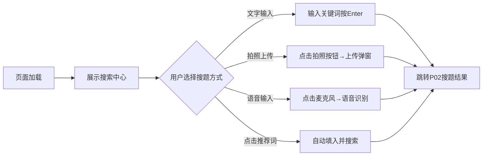
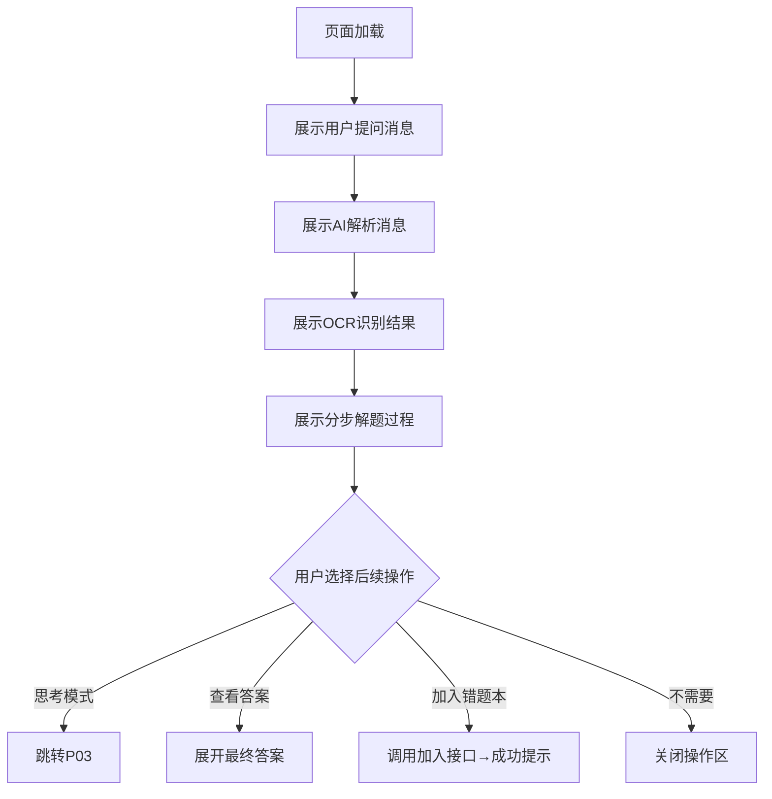
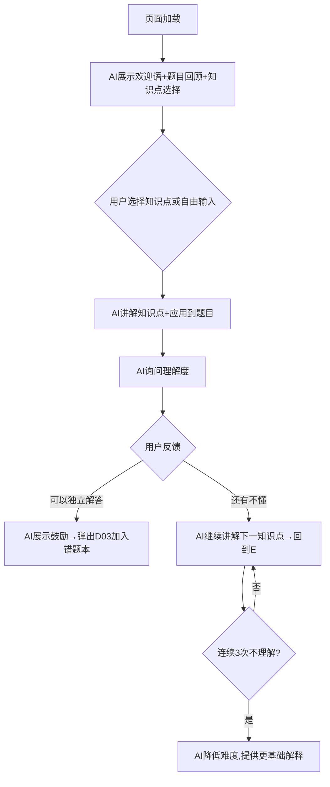
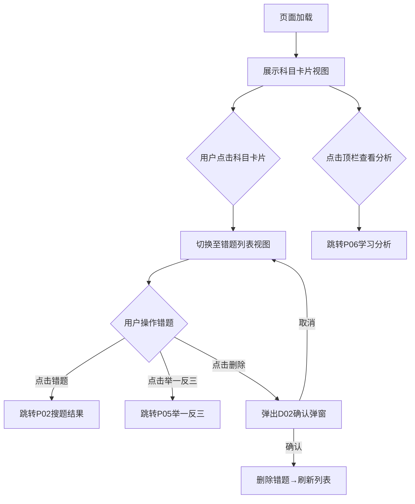
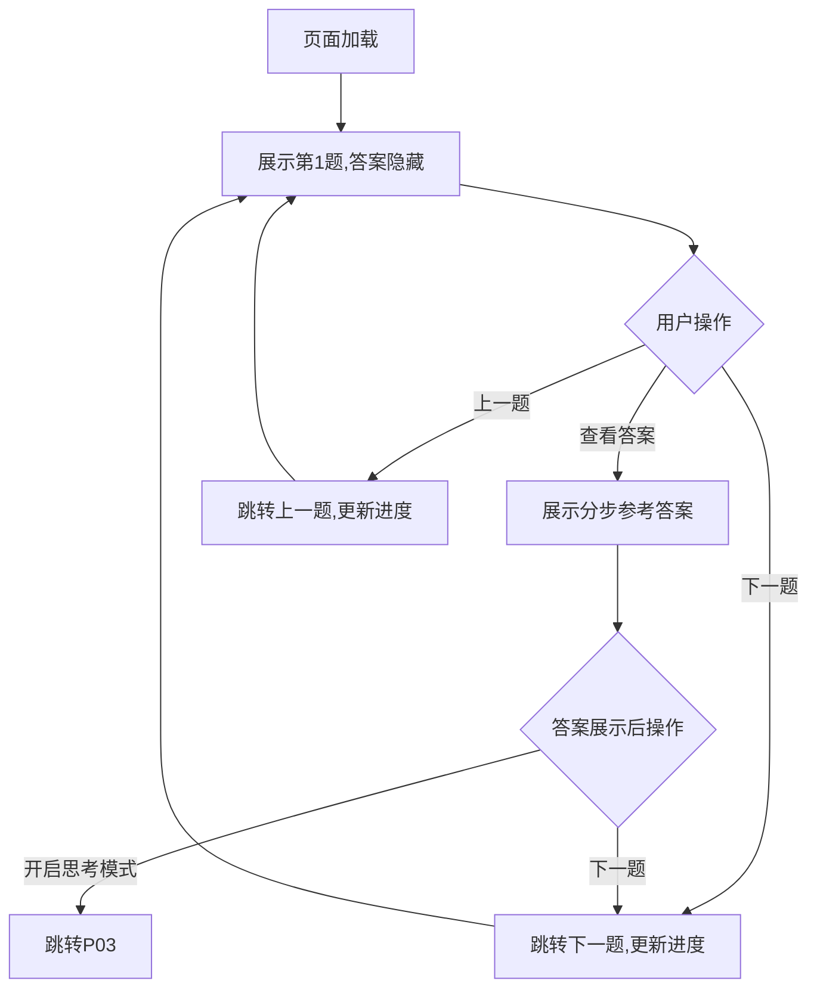
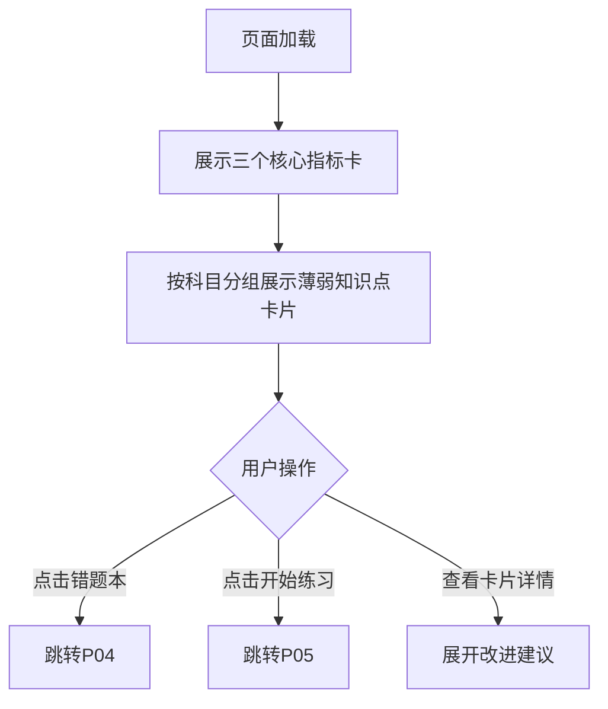

# AI智能搜题 - 原型页面需求分析文档

> 本文档基于6个HTML原型页面的实际截图,配合结构化需求分析说明,形成"截图 + 需求分析"对照文档。适用于产品评审、研发理解、设计参考和测试验收。

---

## 文档信息

| 字段 | 内容 |
|---|---|
| 文档名称 | AI智能搜题原型页面需求分析 |
| 版本号 | V1.0 |
| 创建时间 | 2026-06-01 |
| 原型来源 | `c:\Users\24847\Documents\trae_projects\AIsouti\prototype\` |
| 截图来源 | `c:\Users\24847\Documents\trae_projects\AIsouti\screenshots\` |
| 分析依据 | 原型HTML代码 + PRD文档 + 用户故事 |

---

## 1. P01 搜一搜首页

### 1.1 页面截图

### 1.2 页面基本信息

| 字段 | 内容 |
|---|---|
| 页面编号 | P01 |
| 页面名称 | 搜一搜(首页) |
| 页面类型 | 搜索页 |
| 原型文件 | `prototype/index.html` |
| 截图文件 | `screenshots/P01_搜一搜首页.png` |
| 使用角色 | 学生(未登录/已登录) |
| 入口位置 | 应用默认首页 / 侧边栏"搜一搜"导航 |

### 1.3 页面目标

为学生提供统一的题目搜索入口,支持文字输入、语音输入、拍照上传三种搜题方式,展示过往搜题历史,帮助用户快速发起搜题请求。

### 1.4 页面结构分析

#### 1.4.1 全局布局
- **侧边栏(Sidebar)**: 宽度260px(展开) / 64px(折叠)
  - Logo区域: AI智能搜题品牌标识
  - 主导航: 搜一搜(激活态)、错题本、学习分析
  - 过往搜题历史: 按科目分组(数学12道、语文8道、英语6道),可展开查看具体题目
  - 折叠按钮: 点击收起侧边栏

- **顶栏(Topbar)**: 高度60px
  - 页面标题: "搜一搜"
  - 快捷按钮: 错题本、举一反三

- **主内容区(Page Content)**:
  - 搜索中心区域(居中展示)
  - 主标题: "拍题搜解,智能答疑"
  - 副标题: "上传题目照片,AI为你逐步解析"
  - 搜索栏: 文字输入 + 语音按钮 + 分隔线 + 拍照按钮
  - 推荐提示词: 二次函数求最值 | 文言文虚词 | 三角函数恒等变换

#### 1.4.2 核心交互元素

| 元素 | 类型 | 位置 | 交互行为 |
|---|---|---|---|
| 搜索输入框 | Input | 搜索栏中央 | 输入题目文字,按Enter触发搜索 |
| 语音按钮 | Button | 搜索栏左侧 | 唤起语音输入(待确认实现方式) |
| 拍照按钮 | Button | 搜索栏右侧 | 唤起上传弹窗(D01) |
| 推荐提示词 | Tag/Link | 搜索栏下方 | 点击自动填入搜索框并触发搜索 |
| 侧边栏导航项 | Link | 左侧导航 | 点击跳转对应页面 |
| 过往搜题科目 | Collapsible | 侧边栏内容区 | 点击展开/收起该科目下的题目列表 |
| 过往搜题题目 | Link | 侧边栏展开项 | 点击跳转至该题的搜题结果页 |

### 1.5 用户场景与需求

**场景1: 文字搜题**
- 用户: 初中生小明
- 场景: 做数学作业时遇到"二次函数求最值"问题
- 行为: 在搜索框输入题目关键词,按Enter
- 期望: 5秒内跳转至搜题结果页,看到AI分步解析

**场景2: 拍照搜题**
- 用户: 高中生小红
- 场景: 做物理练习册,题目较长不方便输入
- 行为: 点击拍照按钮,上传题目照片
- 期望: AI自动OCR识别题目,返回结构化解析

**场景3: 查看过往搜题**
- 用户: 学生小李
- 场景: 想回顾昨天搜过的"三角函数"题目
- 行为: 在侧边栏点击"数学"科目展开,找到对应题目
- 期望: 点击后跳转至该题的历史解析结果

### 1.6 核心业务流程

### 1.7 验收标准

| 编号 | 验收项 | 验收标准 |
|---|---|---|
| AC01 | 页面加载 | 页面加载完成时间 < 2秒,侧边栏、顶栏、搜索中心完整渲染 |
| AC02 | 文字搜索 | 输入非空内容按Enter,跳转至P02并携带搜索参数 |
| AC03 | 拍照上传 | 点击拍照按钮,弹出D01上传弹窗,支持JPG/PNG/WEBP |
| AC04 | 推荐提示词 | 点击任意推荐词,自动填入搜索框并触发搜索 |
| AC05 | 侧边栏折叠 | 点击折叠按钮,侧边栏收起至64px,仅显示图标 |
| AC06 | 过往搜题 | 按科目分组展示,点击科目可展开/收起,点击题目可跳转 |

### 1.8 待确认问题

| 编号 | 问题 | 影响范围 | 优先级 |
|---|---|---|---|
| Q01 | 语音输入的具体实现方式(浏览器API/第三方服务)? | 功能实现 | P1 |
| Q02 | 过往搜题数据是否依赖用户登录态?未登录时如何展示? | 数据逻辑 | P1 |
| Q03 | 推荐提示词是固定写死还是根据用户历史动态生成? | 产品策略 | P2 |

---

## 2. P02 搜题结果页

### 2.1 页面截图

### 2.2 页面基本信息

| 字段 | 内容 |
|---|---|
| 页面编号 | P02 |
| 页面名称 | 搜题结果 |
| 页面类型 | 对话页 |
| 原型文件 | `prototype/result.html` |
| 截图文件 | `screenshots/P02_搜题结果.png` |
| 使用角色 | 学生 |
| 入口位置 | P01搜索提交后跳转 / P04错题本点击错题跳转 |

### 2.3 页面目标

展示AI对题目的完整解析结果,包括OCR识别文本、分步解题过程,并提供多种后续学习路径(思考模式、查看答案、加入错题本),引导学生从"看答案"转向"真理解"。

### 2.4 页面结构分析

#### 2.4.1 全局布局
- **侧边栏(Sidebar)**: 与P01一致,提供导航和搜题历史
- **顶栏(Topbar)**: 
  - 页面标题: "搜题结果"
  - 快捷按钮: 错题本、举一反三

- **主内容区(对话流)**:
  - **用户消息区**: 展示用户提问内容(文字或图片)
  - **AI消息区**: 
    - OCR识别结果: 展示从图片中提取的题目文本
    - 完整解析: 分步骤展示解题过程,每步带详细说明
    - 学习模式选择区(解析底部):
      - "🧠 思考模式(推荐)"卡片
      - "📄 直接查看答案"卡片
    - 错题本操作区:
      - "📝 是否加入错题本?"提示
      - "加入错题本"按钮 / "不需要"按钮

#### 2.4.2 核心交互元素

| 元素 | 类型 | 位置 | 交互行为 |
|---|---|---|---|
| 用户消息气泡 | Message | 对话流顶部 | 展示用户输入的题目内容 |
| OCR识别结果 | Text Block | AI消息区顶部 | 展示AI识别的题目文本 |
| 完整解析 | Step List | AI消息区中部 | 分步骤展示解题过程 |
| 思考模式卡片 | Card | AI消息区底部 | 点击跳转P03思考模式页 |
| 查看答案卡片 | Card | AI消息区底部 | 点击展开最终答案 |
| 加入错题本按钮 | Button | 错题本操作区 | 调用加入接口,添加至错题本 |
| 不需要按钮 | Button | 错题本操作区 | 关闭操作区,不加入 |

### 2.5 用户场景与需求

**场景1: 查看AI解析**
- 用户: 学生小明
- 场景: 刚在P01搜索了一道数学题
- 行为: 页面加载后查看AI返回的分步解析
- 期望: 解析清晰、步骤完整,能理解每一步的逻辑

**场景2: 进入思考模式**
- 用户: 学生小红
- 场景: 看完解析后觉得没有真正理解,想深入学习
- 行为: 点击"思考模式(推荐)"卡片
- 期望: 跳转至P03,AI通过引导式对话帮助理解

**场景3: 加入错题本**
- 用户: 学生小李
- 场景: 这道题做错了,想记录下来后续复习
- 行为: 点击"加入错题本"按钮
- 期望: 题目被添加至错题本,可在P04查看

### 2.6 核心业务流程

### 2.7 验收标准

| 编号 | 验收项 | 验收标准 |
|---|---|---|
| AC01 | AI解析加载 | 页面加载后5秒内展示完整AI解析结果 |
| AC02 | OCR识别展示 | 如用户上传了图片,需展示OCR识别文本 |
| AC03 | 分步解析展示 | 解析内容必须分步骤展示,每步有明确说明 |
| AC04 | 思考模式跳转 | 点击"思考模式"卡片,跳转至P03并携带题目参数 |
| AC05 | 加入错题本 | 点击"加入错题本",调用接口成功后展示Toast提示 |
| AC06 | 查看答案 | 点击"直接查看答案",展开最终答案区域 |

### 2.8 待确认问题

| 编号 | 问题 | 影响范围 | 优先级 |
|---|---|---|---|
| Q04 | AI解析超时(>15秒)时的降级策略? | 异常处理 | P0 |
| Q05 | 错题本加入后是否需要立即刷新侧边栏错题数量? | 数据同步 | P1 |
| Q06 | "查看答案"后是否强制弹出加入错题本引导? | 产品策略 | P1 |

---

## 3. P03 思考模式页

### 3.1 页面截图

### 3.2 页面基本信息

| 字段 | 内容 |
|---|---|
| 页面编号 | P03 |
| 页面名称 | 思考模式 |
| 页面类型 | 对话页 |
| 原型文件 | `prototype/thinking.html` |
| 截图文件 | `screenshots/P03_思考模式.png` |
| 使用角色 | 学生 |
| 入口位置 | P02搜题结果页点击"思考模式"卡片 |

### 3.3 页面目标

AI扮演"老师"角色,通过引导式对话引导学生逐步理解题目,而非直接告知答案。根据学生的反馈动态调整讲解策略,实现真正的"理解"而非"抄答案"。

### 3.4 页面结构分析

#### 3.4.1 全局布局
- **顶栏(Topbar)**: 
  - 返回按钮: 左上角"←返回",点击返回P02
  - 页面标题: "思考模式"
  - 题目名称: 当前思考的题目(如"二次函数求最值")
  - 退出按钮: 右上角"退出",点击弹出加入错题本引导

- **主内容区(对话流)**:
  - **AI欢迎消息**:
    - 欢迎语: "欢迎进入思考模式!我会引导你一步步理解这道题。"
    - 题目回顾: 展示当前题目内容
    - 知识点选择: 提供4个快捷知识点按钮(如"配方法是什么?""顶点式怎么用?"等)
  - **用户消息**: 学生选择的知识点或自由输入的疑问
  - **AI讲解消息**:
    - 知识点讲解卡片(含核心概念、关键公式)
    - 将知识点应用到当前题目的推导过程
    - "生成图示"按钮(可选)
    - 理解度检测问题: "现在你觉得能独立解答出来吗?"
    - 理解度检测按钮: "👍 可以独立解答" / "👎 还有不懂的地方"

- **底部输入区**:
  - 输入框: "输入你的疑问..."
  - 发送按钮: "➤"

#### 3.4.2 核心交互元素

| 元素 | 类型 | 位置 | 交互行为 |
|---|---|---|---|
| 返回按钮 | Button | 顶栏左侧 | 点击返回P02搜题结果页 |
| 退出按钮 | Button | 顶栏右侧 | 点击弹出D03加入错题本弹窗 |
| 知识点快捷按钮 | Tag/Button | AI欢迎消息区 | 点击直接发送该知识点疑问 |
| 知识点讲解卡片 | Card | AI讲解消息区 | 展示知识点核心概念和关键公式 |
| 生成图示按钮 | Button | AI讲解消息区 | 点击弹出配方过程图示弹窗 |
| 理解度检测按钮 | Button Group | AI讲解消息底部 | 点击反馈理解程度 |
| 底部输入框 | Input | 页面底部 | 输入自由疑问,点击发送或按Enter |

### 3.5 用户场景与需求

**场景1: 选择知识点深入学习**
- 用户: 学生小明
- 场景: 进入思考模式后,不知道从哪里开始
- 行为: 点击"配方法是什么?"快捷按钮
- 期望: AI讲解配方法的核心概念,并应用到当前题目

**场景2: AI讲解后反馈理解度**
- 用户: 学生小红
- 场景: AI讲解完配方法后询问是否理解
- 行为: 点击"还有不懂的地方"
- 期望: AI换一种角度继续讲解,或降低难度

**场景3: 完成思考模式**
- 用户: 学生小李
- 场景: 经过多轮对话后终于理解
- 行为: 点击"可以独立解答"
- 期望: AI展示鼓励消息,引导加入错题本

### 3.6 核心业务流程

### 3.7 验收标准

| 编号 | 验收项 | 验收标准 |
|---|---|---|
| AC01 | 页面加载 | 加载后展示AI欢迎语、题目回顾、4个知识点快捷按钮 |
| AC02 | 知识点讲解 | 点击快捷按钮或自由输入后,AI生成知识点讲解卡片 |
| AC03 | 理解度检测 | 每次讲解结束后必须展示理解度检测按钮 |
| AC04 | 连续不理解处理 | 连续3次"不理解",AI主动降低讲解难度 |
| AC05 | 完成引导 | 点击"可以独立解答",弹出D03加入错题本弹窗 |
| AC06 | 退出保护 | 点击右上角"退出",弹出D03引导加入错题本 |

### 3.8 待确认问题

| 编号 | 问题 | 影响范围 | 优先级 |
|---|---|---|---|
| Q07 | 对话进度是否需要持久化(刷新/后退后恢复)? | 技术实现 | P1 |
| Q08 | "生成图示"功能的具体实现方式(前端Canvas/AI生成图片)? | 功能实现 | P2 |
| Q09 | 知识点快捷按钮是固定写死还是根据题目动态生成? | 产品策略 | P1 |

---

## 4. P04 错题本页

### 4.1 页面截图

### 4.2 页面基本信息

| 字段 | 内容 |
|---|---|
| 页面编号 | P04 |
| 页面名称 | 错题本 |
| 页面类型 | 列表页(科目卡片视图 + 错题列表视图) |
| 原型文件 | `prototype/errorbook.html` |
| 截图文件 | `screenshots/P04_错题本.png` |
| 使用角色 | 学生 |
| 入口位置 | 侧边栏"错题本"导航 / 顶栏"错题本"按钮 |

### 4.3 页面目标

为学生提供结构化的错题管理界面,按科目分类展示错题,支持查看、删除、举一反三跳转,为薄弱点分析提供数据基础。

### 4.4 页面结构分析

#### 4.4.1 全局布局
- **侧边栏(Sidebar)**: 与P01一致
- **顶栏(Topbar)**: 
  - 页面标题: "错题本"
  - 快捷按钮: 举一反三、查看分析

- **主内容区(双视图)**:
  
  **视图1: 科目卡片视图(默认)**
  - 页面标题: "我的错题本"
  - 副标题: "按科目分类管理"
  - 总错题数: "共26道"
  - 科目卡片列表:
    - 每个卡片包含: 科目图标、科目名称、错题数量、掌握进度条
    - 示例: 数学(12道,60%)、语文(8道,40%)、英语(6道,30%)

  **视图2: 错题列表视图(点击科目卡片后)**
  - 顶栏标题: "错题本 / 数学"
  - 列表头部: "←返回"按钮、科目名称、错题数量
  - 错题列表:
    - 每个错题项包含: 题目标题、知识点标签、错题日期、薄弱知识点
    - 行内操作: 💡举一反三按钮、🗑️删除按钮

#### 4.4.2 核心交互元素

| 元素 | 类型 | 位置 | 交互行为 |
|---|---|---|---|
| 科目卡片 | Card | 科目卡片视图 | 点击切换至该科目的错题列表视图 |
| 返回按钮 | Button | 错题列表视图顶部 | 点击返回科目卡片视图 |
| 错题条目 | List Item | 错题列表视图 | 点击跳转至P02搜题结果页 |
| 举一反三按钮 | Button | 错题条目右侧 | 跳转P05,携带当前错题知识点参数 |
| 删除按钮 | Button | 错题条目右侧 | 弹出D02删除确认弹窗 |
| 查看分析按钮 | Button | 顶栏 | 跳转P06学习分析页 |

### 4.5 用户场景与需求

**场景1: 查看某科目错题**
- 用户: 学生小明
- 场景: 想复习数学错题
- 行为: 在科目卡片视图点击"数学"卡片
- 期望: 切换至错题列表视图,展示所有数学错题

**场景2: 针对错题进行练习**
- 用户: 学生小红
- 场景: 发现"二次函数"这道题薄弱
- 行为: 点击该错题的"💡举一反三"按钮
- 期望: 跳转P05,针对"二次函数"知识点练习

**场景3: 删除错题**
- 用户: 学生小李
- 场景: 某道题已经掌握,不需要再复习
- 行为: 点击该错题的"🗑️删除"按钮
- 期望: 弹出二次确认,确认后删除该错题

### 4.6 核心业务流程

### 4.7 验收标准

| 编号 | 验收项 | 验收标准 |
|---|---|---|
| AC01 | 页面加载 | 默认展示科目卡片视图,显示各科目错题数量和进度条 |
| AC02 | 科目切换 | 点击科目卡片,切换至该科目错题列表视图 |
| AC03 | 错题跳转 | 点击错题条目,跳转至P02并展示该题解析 |
| AC04 | 举一反三跳转 | 点击💡按钮,跳转P05并携带知识点参数 |
| AC05 | 删除确认 | 点击🗑️按钮,弹出D02二次确认弹窗 |
| AC06 | 返回视图 | 点击"←返回",从列表视图返回科目卡片视图 |

### 4.8 待确认问题

| 编号 | 问题 | 影响范围 | 优先级 |
|---|---|---|---|
| Q10 | 掌握进度条的计算逻辑(已掌握题目/总题目)? | 数据逻辑 | P0 |
| Q11 | 错题列表是否支持分页或无限滚动? | 交互设计 | P2 |
| Q12 | 删除后的错题是否支持回收站恢复? | 数据安全 | P2 |

---

## 5. P05 举一反三练习页

### 5.1 页面截图

### 5.2 页面基本信息

| 字段 | 内容 |
|---|---|
| 页面编号 | P05 |
| 页面名称 | 举一反三 |
| 页面类型 | 练习页(题目面板 + 答案面板) |
| 原型文件 | `prototype/practice.html` |
| 截图文件 | `screenshots/P05_举一反三.png` |
| 使用角色 | 学生 |
| 入口位置 | P02搜题结果页顶栏 / P04错题本顶栏 / P04错题行内按钮 / P06学习分析顶栏 |

### 5.3 页面目标

针对薄弱知识点,智能推荐相似练习题,帮助学生通过练习巩固理解,实现"做一题会一类"。

### 5.4 页面结构分析

#### 5.4.1 全局布局
- **侧边栏(Sidebar)**: 与P01一致
- **顶栏(Topbar)**: 
  - 页面标题: "举一反三 针对薄弱知识点"
  - 导航按钮: ←上一题、下一题→

- **主内容区**:
  - **进度指示区**:
    - 当前题号/总题数: "第 1 / 3 题"
    - 进度条: 可视化当前进度
    - 知识点标签: "🎯 配方法"
  
  - **双栏布局**:
    - **左栏: 练习题面板**
      - 题目标题: "练习题"
      - 题目内容: 多小题题目(含公式、图文)
      - 考查说明: "ℹ️ 本题考查:配方法在二次函数中的应用"
    
    - **右栏: 参考答案面板**
      - 默认状态: 🔒 答案已隐藏 + "先尝试完成"提示 + "查看答案"按钮
      - 展示状态: 点击查看后展示分步参考答案(step-card)
  
  - **底部推荐区**:
    - "🧠 想要更深入理解?"提示
    - "开启思考模式"卡片(推荐): 跳转P03
    - "下一题"按钮: 进入下一道练习

#### 5.4.2 核心交互元素

| 元素 | 类型 | 位置 | 交互行为 |
|---|---|---|---|
| 上一题按钮 | Button | 顶栏左侧 | 点击跳转至上一题(第1题时禁用) |
| 下一题按钮 | Button | 顶栏右侧 | 点击跳转至下一题(最后1题时禁用) |
| 进度条 | Progress Bar | 进度指示区 | 随题号动态更新 |
| 查看答案按钮 | Button | 答案面板 | 点击展开分步参考答案 |
| 开启思考模式卡片 | Card | 底部推荐区 | 点击跳转P03思考模式 |
| 下一题按钮 | Button | 底部推荐区 | 点击进入下一道练习 |

### 5.5 用户场景与需求

**场景1: 开始练习**
- 用户: 学生小明
- 场景: 从P06学习分析进入,想针对"配方法"薄弱点练习
- 行为: 页面加载后查看第1题,尝试独立完成
- 期望: 题目难度适中,与薄弱知识点强相关

**场景2: 查看答案**
- 用户: 学生小红
- 场景: 完成题目后想核对答案
- 行为: 点击"查看答案"按钮
- 期望: 展示分步参考答案,每步有方法说明

**场景3: 深入理解**
- 用户: 学生小李
- 场景: 看完答案后觉得还需要更深入理解
- 行为: 点击"开启思考模式"卡片
- 期望: 跳转P03,针对该题知识点进行引导式学习

### 5.6 核心业务流程

### 5.7 验收标准

| 编号 | 验收项 | 验收标准 |
|---|---|---|
| AC01 | 页面加载 | 展示第1题,答案区域默认隐藏(锁图标+提示) |
| AC02 | 查看答案 | 点击"查看答案",展示分步参考答案 |
| AC03 | 题号导航 | 上一题/下一题按钮正常跳转,进度条同步更新 |
| AC04 | 边界禁用 | 第1题时"上一题"禁用,最后1题时"下一题"禁用 |
| AC05 | 思考模式跳转 | 点击"开启思考模式",跳转P03并携带知识点参数 |
| AC06 | 空状态处理 | 无可用练习题时展示"暂无练习题,AI正在生成中" |

### 5.8 待确认问题

| 编号 | 问题 | 影响范围 | 优先级 |
|---|---|---|---|
| Q13 | 练习题是AI实时生成还是从题库检索? | 技术架构 | P0 |
| Q14 | 练习完成后是否记录正确率并更新掌握进度? | 数据逻辑 | P0 |
| Q15 | 是否支持用户标记"已掌握"或"还需练习"? | 交互设计 | P1 |

---

## 6. P06 学习分析页

### 6.1 页面截图

### 6.2 页面基本信息

| 字段 | 内容 |
|---|---|
| 页面编号 | P06 |
| 页面名称 | 学习分析 |
| 页面类型 | 看板页(Dashboard) |
| 原型文件 | `prototype/analysis.html` |
| 截图文件 | `screenshots/P06_学习分析.png` |
| 使用角色 | 学生 |
| 入口位置 | 侧边栏"学习分析"导航 / 顶栏"查看分析"按钮 |

### 6.3 页面目标

基于错题和对话记录,AI自动生成个性化学习报告,直观展示学生的知识薄弱点,指导针对性学习。

### 6.4 页面结构分析

#### 6.4.1 全局布局
- **侧边栏(Sidebar)**: 与P01一致
- **顶栏(Topbar)**: 
  - 页面标题: "学习分析"
  - 快捷按钮: 错题本、开始练习

- **主内容区**:
  - **页面标题区**:
    - 主标题: "知识薄弱点分析"
    - 副标题: "AI基于你的错题本生成个性化学习报告"
  
  - **核心指标卡(3个)**:
    - 📚 总错题数: 26
    - ⚠️ 薄弱知识点数: 9
    - 📈 掌握率: 68%
  
  - **薄弱知识点列表(按科目分组)**:
    - **数学组**(基于12道数学错题分析):
      - 配方法: [薄弱] 进度25%, 错误5次, 改进建议
      - 三角恒等变换: [薄弱] 进度30%, 错误4次, 改进建议
      - 条件概率: [待提高] 进度50%, 错误3次, 改进建议
    
    - **语文组**(基于8道语文错题分析):
      - 文言文虚词: [薄弱] 改进建议
      - (更多知识点...)

#### 6.4.2 薄弱知识点卡片结构

| 字段 | 类型 | 说明 |
|---|---|---|
| 知识点名称 | 文本 | 如"配方法"、"三角恒等变换" |
| 薄弱等级标签 | Enum Tag | 薄弱(红色)、待提高(橙色)、一般(绿色) |
| 进度条 | Progress Bar | 可视化掌握进度,颜色与薄弱等级映射 |
| 改进建议 | Text | AI给出的针对性学习建议 |
| 错误次数 | Number | 该知识点累计错误次数 |

#### 6.4.3 核心交互元素

| 元素 | 类型 | 位置 | 交互行为 |
|---|---|---|---|
| 错题本按钮 | Button | 顶栏 | 跳转P04错题本 |
| 开始练习按钮 | Button | 顶栏 | 跳转P05举一反三 |
| 薄弱知识点卡片 | Card | 主内容区 | 展示知识点详细信息 |
| 薄弱等级标签 | Tag | 卡片内 | 颜色映射: 薄弱(红)、待提高(橙)、一般(绿) |

### 6.5 用户场景与需求

**场景1: 查看学习报告**
- 用户: 学生小明
- 场景: 积累了一定错题后,想了解自己的薄弱点
- 行为: 点击侧边栏"学习分析"
- 期望: 看到总错题数、薄弱知识点数、掌握率三个核心指标

**场景2: 针对薄弱点练习**
- 用户: 学生小红
- 场景: 发现"配方法"掌握率只有25%
- 行为: 点击顶栏"开始练习"
- 期望: 跳转P05,针对"配方法"知识点进行练习

**场景3: 查看错题详情**
- 用户: 学生小李
- 场景: 想查看具体哪些题目导致了薄弱点
- 行为: 点击顶栏"错题本"
- 期望: 跳转P04,查看错题列表

### 6.6 核心业务流程

### 6.7 验收标准

| 编号 | 验收项 | 验收标准 |
|---|---|---|
| AC01 | 页面加载 | 展示标题、副标题、三个核心指标卡 |
| AC02 | 指标数据 | 总错题数、薄弱知识点数、掌握率数据准确 |
| AC03 | 分组展示 | 薄弱知识点按科目分组,每组标题显示分析依据 |
| AC04 | 薄弱等级颜色 | 薄弱(红色<35%)、待提高(橙色35%-60%)、一般(绿色>60%) |
| AC05 | 跳转功能 | 顶栏"错题本"跳转P04,"开始练习"跳转P05 |
| AC06 | 空状态 | 无错题数据时展示"暂无学习数据,请先搜题或添加错题" |

### 6.8 待确认问题

| 编号 | 问题 | 影响范围 | 优先级 |
|---|---|---|---|
| Q16 | 掌握率的计算公式(已解决错题/总错题)? | 数据逻辑 | P0 |
| Q17 | 薄弱等级判定阈值是否可配置? | 产品策略 | P1 |
| Q18 | AI分析报告的生成频率(实时/每日定时/手动触发)? | 技术架构 | P0 |

---

## 7. 弹窗需求分析

### 7.1 D01 上传题目照片弹窗

#### 7.1.1 弹窗基本信息

| 字段 | 内容 |
|---|---|
| 弹窗编号 | D01 |
| 弹窗名称 | 上传题目照片 |
| 弹窗类型 | Modal 弹窗 |
| 触发位置 | P01搜索栏右侧拍照按钮 |
| 使用角色 | 学生 |

#### 7.1.2 弹窗结构
- 标题: "上传题目照片"
- 上传区域: 点击或拖拽照片到此处,支持JPG、PNG、WEBP格式
- 操作按钮: 取消(幽灵按钮)、开始搜题(主按钮,选择文件后显示)

#### 7.1.3 交互流程
1. 点击拍照按钮 → 弹出D01
2. 点击上传区域 → 唤起文件选择器 → 选择图片后显示预览
3. 拖拽图片到上传区域 → 高亮边框 → 释放后显示预览
4. 点击"开始搜题" → 关闭弹窗 → 跳转P02
5. 点击"取消"或点击覆盖层外部 → 关闭弹窗

#### 7.1.4 验收标准
- AC01: 支持JPG/PNG/WEBP格式,最大10MB
- AC02: 选择文件后显示预览和"开始搜题"按钮
- AC03: 文件格式不符时提示"仅支持JPG、PNG、WEBP格式"
- AC04: 文件过大时提示"图片过大,请压缩后重新上传"

---

### 7.2 D02 删除确认弹窗

#### 7.2.1 弹窗基本信息

| 字段 | 内容 |
|---|---|
| 弹窗编号 | D02 |
| 弹窗名称 | 删除确认 |
| 弹窗类型 | Modal 弹窗 |
| 触发位置 | P04错题列表项删除按钮 |
| 使用角色 | 学生 |

#### 7.2.2 弹窗结构
- 图标: ⚠️ 警告图标(红色)
- 标题: "确认删除"
- 描述: "确定要删除这道错题吗?删除后将无法恢复。"
- 按钮: 取消(幽灵按钮)、确认删除(危险按钮-红色)

#### 7.2.3 交互流程
1. 点击删除按钮 → 弹出D02
2. 点击"取消" → 关闭弹窗
3. 点击"确认删除" → 执行删除 → 关闭弹窗 → 列表项移除 → 展示Toast"已删除"

#### 7.2.4 验收标准
- AC01: 必须二次确认,防止误删
- AC02: 删除成功后展示Toast提示
- AC03: 删除后错题数据不可恢复(除非有回收站机制)

---

### 7.3 D03 加入错题本弹窗

#### 7.3.1 弹窗基本信息

| 字段 | 内容 |
|---|---|
| 弹窗编号 | D03 |
| 弹窗名称 | 加入错题本 |
| 弹窗类型 | Modal 弹窗 |
| 触发位置 | P02搜题结果页查看答案后 / P03思考模式完成 |
| 使用角色 | 学生 |

#### 7.3.2 弹窗结构
- 标题: "是否将本题加入错题本?"
- 描述: "加入后,AI会为你总结本次对话,生成知识薄弱点分析,帮助你针对性提高。"
- 按钮: 不需要(幽灵按钮)、加入错题本(主按钮)

#### 7.3.3 交互流程
1. 关键学习节点触发 → 弹出D03
2. 点击"不需要" → 关闭弹窗
3. 点击"加入错题本" → 调用加入接口 → 关闭弹窗 → 展示成功提示

#### 7.3.4 验收标准
- AC01: 在关键节点(搜题完成/思考模式完成)自动触发
- AC02: 加入成功后展示Toast提示
- AC03: 描述文案需突出加入错题本的价值

---

## 8. 全局交互规范

### 8.1 侧边栏交互规范
- 展开宽度: 260px
- 折叠宽度: 64px(仅显示图标)
- 导航激活态: 高亮背景 + 左侧指示条
- 过往搜题: 按科目分组,可展开/收起,点击题目跳转

### 8.2 顶栏交互规范
- 高度: 60px
- 标题: 左侧展示当前页面名称
- 快捷按钮: 右侧展示常用功能入口(错题本、举一反三等)

### 8.3 页面跳转规范
- 侧边栏导航: 直接跳转,不携带参数
- 功能跳转: 携带必要参数(如知识点、题目ID等)
- 返回按钮: 返回上一页或上一级视图

### 8.4 异常处理规范
- 网络异常: 展示"网络连接失败,请检查网络后重试"
- 数据加载失败: 展示"加载失败,点击重试"
- AI超时: 展示"AI正在思考中,请稍候" → 30秒后提示"网络异常,请重试"
- 空状态: 展示空状态插画 + 引导文案

---

## 9. 需求优先级建议

### P0 (必须实现)
- P01: 文字搜索、拍照上传、AI解析展示
- P02: 分步解析展示、思考模式跳转、加入错题本
- P03: 引导式对话、知识点讲解、理解度检测
- P04: 科目卡片视图、错题列表视图、删除功能
- P05: 练习题展示、答案隐藏/展示、题号导航
- P06: 核心指标卡、薄弱知识点分组展示、薄弱等级判定

### P1 (强烈建议)
- P01: 语音输入、过往搜题历史
- P03: 对话进度持久化、生成图示功能
- P04: 掌握进度计算逻辑
- P05: 练习正确率记录、思考模式跳转
- P06: 掌握率计算公式、分析报告生成频率

### P2 (可选优化)
- P01: 推荐提示词动态生成
- P04: 错题列表分页、回收站机制
- P05: 用户标记"已掌握"/"还需练习"
- P06: 薄弱等级阈值可配置

---

## 10. 研发实现建议

### 10.1 前端技术栈
- 框架: 保持现有HTML + CSS + JS原生实现
- 图标: Lucide Icons(已在原型中使用)
- 图表: 进度条可使用原生CSS或轻量级图表库
- 状态管理: 简单场景可使用localStorage,复杂场景建议引入Vuex/Redux

### 10.2 后端接口需求
| 接口 | 方法 | 路径 | 说明 |
|---|---|---|---|
| 搜题 | POST | `/api/search` | 接收文字/图片,返回AI解析 |
| 加入错题本 | POST | `/api/error-records` | 添加错题记录 |
| 获取错题列表 | GET | `/api/error-records?subject=xxx` | 按科目获取错题 |
| 删除错题 | DELETE | `/api/error-records/:id` | 删除指定错题 |
| 获取学习分析 | GET | `/api/analysis` | 获取薄弱点分析报告 |
| 获取练习题 | GET | `/api/practice?knowledge=xxx` | 按知识点获取练习题 |

### 10.3 AI服务需求
- OCR服务: 图片题目识别
- 解析生成Agent: 分步解题过程生成
- 引导式对话Agent: 思考模式引导
- 薄弱点分析Agent: 学习报告生成
- 练习题生成Agent: 相似题目生成

---

## 附录A: 页面路由映射表

| 页面编号 | 页面名称 | 原型文件 | 路由路径(建议) |
|---|---|---|---|
| P01 | 搜一搜 | index.html | `/` |
| P02 | 搜题结果 | result.html | `/result` |
| P03 | 思考模式 | thinking.html | `/thinking` |
| P04 | 错题本 | errorbook.html | `/errorbook` |
| P05 | 举一反三 | practice.html | `/practice` |
| P06 | 学习分析 | analysis.html | `/analysis` |

---

## 附录B: 版本更新记录

| 版本 | 日期 | 更新内容 | 作者 |
|---|---|---|---|
| V1.0 | 2026-06-01 | 初始版本,完成6个页面+3个弹窗的需求分析 | AI产品助手 |

---

> 本文档基于原型页面实际截图和PRD文档生成,所有需求分析均以原型代码为事实来源。待确认问题需在后续产品评审中与业务方、研发团队确认。
